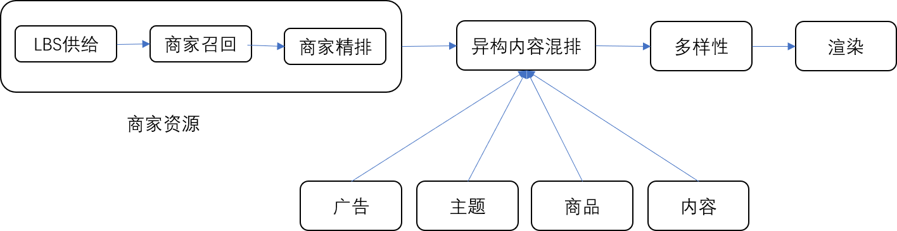
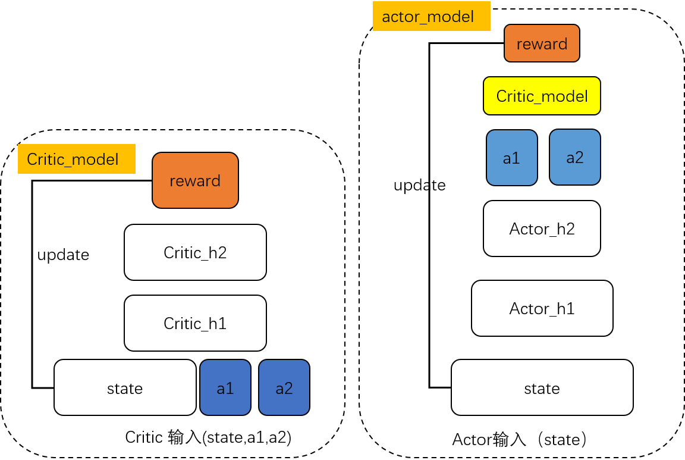

# 推荐排序机制在品类新客优化上的探索与实践

## 一、引言
&emsp;基于算法的推荐系统存在一个被广为诟病的特性就是“信息茧房”效应：算法通常根据用户在平台的历史行为建模用户兴趣，并在此基础上给用户推荐新的内容，而新推荐的内容又影响到用户接下来的行为。在这种机制上，推荐系统不断强化之前观察到的用户兴趣，让推荐的内容陷入相似信息的“回音室”，导致用户看到的信息陷入一个狭小的范围，限制用户对于信息的感知。

&emsp;在外卖推荐场景，“信息茧房”对于用户体验的负向影响非常明显，用户在外卖平台存在较强的复购规律，因此系统非常容易给用户推荐之前购买过的商家以及同类型的商家，导致内容同质化。长期来看，用户对于平台的认知更容易局限于某些固定类型的供给上，导致平台无法满足用户寻找不同类型的商家需求。

&emsp;为了解决这个问题，尝试通过算法的优化和流量的引导，促使用户成交其之前未购买过的商家类型。对于商家类型的刻画，使用外卖场景下现有的商家品类体系，例如火锅、奶茶等。在业务目标上，除了常规的转化效率目标之外，增加了品类新客订单量的目标。

&emsp;本文分享美团外卖推荐团队在首页feed上进行品类新客订单量优化方面的工作。目标是通过feed的策略优化，给“外卖全局”增加x%的品类新客订单量，同时对首页feed的短期转化效率有一些约束。与大部分推荐系统链路类似，首页feed主要模块包括召回、精排、机制策略等。在算法优化上，首选对召回的供给丰富度和精排模型对于新品类的预估能力进行分析，发现除了一些局部的问题需要优化之外，整体上空间较为有限。因此，重点放在机制策略上：

* 增加在首页feed的新品类订单量：主要工作是结合最优化理论，设置排序逻辑，更好平衡多目标，包括品类新客订单量、首页feed转化效率等。
* 在前面的基础上，尝试通过调整首页feed的流量分发策略，促进用户在其他场景（搜索）成交新的品类
* 最后，对上述策略中的参数进行个性化，主要是使用强化学习，学习不同用户在不同时间、地点下的最优排序参数。

## 二、问题与挑战
首页feed一直以来的优化方向都是短期用户体验和转化效率，例如用户的点击率、订单量、成交额等。对于品类新客的优化，和已有工作目标存在较大区别，其主要的挑战如下：

* 新品类短期的转化率通常低于用户经常购买的品类，在带来品类新客订单的同时，需要兼顾短期的转化效率。
* 除了要优化首页feed本身的品类新客订单量之外，算法还要考虑如何通过首页feed策略影响用户在其他入口的成单，让全局收益最大化。
* 不同用户在不同时间、地点下，对于购买新品类的偏好不一样，因此针对新品类的策略都需要考虑用户本身的特点和用户所处的时空场景。

## 三、重点工作
### 3.1 推荐技术框架
&emsp;美团外卖的推荐流量主要集中在首页feed、频道页等，其中以首页feed的流量最大，承载力商家、商品、主题卡片、内容卡片、广告等多种形式的异构内容的流量分发。从技术框架上，最上游的混排模块从商家、商品、广告、主题等服务获取异构资源候选，并融合成最终的排序列表。列表中流量占比最大的是商家卡片。对于品类新客方面的工作，主要放在混排的排序机制方面，此外也花了一小部分精力优化商家排序链路，包括召回、精排、排序策略等模块。

图1：首页feed推荐架构

### 3.2 流量分发策略
&emsp;业务逻辑上我们认为一次品类新客成单的价值大于一次复购成单，在此逻辑上流量分发的策略需要往新品类倾斜。通常的流量倾斜有两种方式，一是给额外的固定曝光位置，二是在排序过程中增加权重。在这里我们选择第二种方式，主要考虑点是：1.新品类商家卡片形态与正常商家没有区别，也不属于冷启动商家，因此不需要单独的链路；2.需要将新品类的流量导流到喜欢尝新的用户上去，并且与其他商家做价值的比较和权衡。

&emsp; 因此，我们选择在排序目标里面加上新品类的额外价值实现流量倾斜。初期，我们通过增加额外的品类新客商家卡片的曝光价值，即将线上的原排序公式设置为：$f = u + \alpha * isNewCategory$（公式一），其中u为原始排序公式，包括点击率、转化率、单价、一些生态项等，但是很快发现新品类的首页feed转化率非常低，导致增加的曝光量不能有效转化为业务需要的订单。因此，我们迭代了一些策略提升新品类的首页feed转化率，主要手段在公式一增加一些特征，例如用户近期对于目标品类的统计行为，即$f = u + \alpha * g(x) * isNewCategory$（公式二），其中g(x)是用户历史统计行为特征的函数，使用了在外卖APP内对目标商家近期点击数量，对目标品类的搜索量等多个特征，而其参数通过人工基于线上实验效果调整确定。这项目工作取得了明显收益，但很快发现线上的排序公式变得过于臃肿，难以持续迭代。参考Linkedin针对广告曝光策略的工作，我们定义了最优化问题如下，这里假设推荐任务是从N个候选商家里面选择1个商家进行曝光。其中效率约束包括整体的点击率、交易额，需要最大化的最新品类的额外价值，而这些价值通常由模型预估得到。
$$\underset{x_{ij}}{max}\sum_{i \in I}\sum_{j \in J(i)} x^{n}_{ij}v^{n}{ij}$$
$$s.t.$$ 
$$sum_{i \in I}\sum_{j \in J(i)} (x^{T}_{ij}u^{T}_{ij} + x^{n}_{ij}u^{n}_{ij}) \ge C$$
$$x^{T}_{ij} + x^{n}_{ij} = 1$$
$$x^{T}_{ij},x^{n}_{ij} \in {1,0}, \forall j \in J(i), \forall i \in I$$

其中i表示第i条请求，I：全部请求集合；j为第j个曝光位，J(i)：第i条请求下全部曝光位集合；$x^{T}_{ij},x^{n}_{ij}$：曝光位0-1变量，如第i条请求下第j个曝光位，选择曝光新品类，则$X^{T}_{ij} = 0, X^{n}_{ij}=1$，否则$X^{T}_{ij} = 1, X^{n}_{ij}=0$；$u^{r}_{ij}, u^{n}_{ij}$：第i条请求下第j个曝光位选择正常商家、新品类商家分别的效率价值；$v^{n}_{ij}$：新品类商家的额外价值；c：整体效率约束。

&emsp;基于上述优化问题，最终的排序公式为$f = u + \alpha * v_{ij} * isNewCategory$（公式三）。对于新品类而言，额外的价值被定义为新品类的首页feed转化效率。因此，这里的$v_{ij}$是模型预估的曝光到订单的转化率。在此基础上，将公式二里的特征融入到精排模型，再应用公式三，得到等同的效果，但在排序公式里去掉了g(x)里面的特征和需要人工调整的参数，使得复杂度大大降低。

&emsp;我们进一步对不同形式的排序公式进行了分析和验证，对一次请求而言，公式三和公式一，都是提升新品类商家在排序中的位置，为什么效果差异非常大？而分析上文中的优化问题发现，高效流量倾斜的关机在于将新品类的业务目标分解到哪些用户上，从这个角度考虑，公式三相比于公式一，更容易将流量导往偏好新品类的用户。事实上，不仅限于品类新客这个任务，以上基于最优化的分析可以推广到任一需要平衡多目标的场景。在某个场景下，当我们有a、b、c等N个目标的时候，加入$v_{a} v_{b} ... v_{N}$是模型对于这N个目标的价值预估，那么帕累托最优的排序公式是：$f = \alpha_{a} * v_{a} + \alpha_{b} * v_{b} + ... + \alpha_{N} * v_{N}$（公式四），而非其他的形式。为了得出这个结论，除了上述理论分析之外，我们还做了一些模拟实验，研究不同排序设定下权衡多目标的Efficient Frontier。在模拟场景下，我们假设每次推荐的请求是从两个候选商家中选择一个，并且关注两个指标metric A 和 metric B，其对应的预估率为$p_{A}$和$p_{B}$。模拟实验得到结论：图中两种不同的公式形式，在效果上存在显著差别，公式四是更优的形式。

&emsp;采用类似的分析方法，研究了训练模型的过程中进行样本采样产生的预估率和真实目标期望的偏差，对于多目标权衡的影响。比较了使用公式四基于未经校正和经过校准的预估率两种设定进行排序的效果，其中模拟实验下的校准方式参考Facebook的工作。模拟实验结果表明，未经校准的预估率会对多目标的权衡产生影响。基于上述结论，针对商家对于曝光到点击、曝光到转化等预估率分别进行校准。

### 3.3 跨入口同品类激发策略
&emsp;我们的业务目标是外卖全局的新品类订单量，前期我们主要通过增加首页feed新品类订单量的方式，促进全局订单量的提升。实验中发现，首页feed产生的品类新客订单量收益，对其他入口有明显的抢占效应，导致全局的增量相比首页feed入口产生的增量有明显衰减。因此，仅仅通过促使用户在首页feed成单新品类可能是一个次优的方向。从全局收益出发，是否能使用首页feed促进用户在其他入口成交呢？我们给出了进一步的探索。

&emsp;我们猜想很多用户会因为在推荐列表看到某个品类的商家之后，去其他入口（例如搜索）找到更合适的同品类商家进行成交。例如，用户在首页feed看到一家烤鱼店，但是因为某些因素不合适，于是跳转到搜索入口去搜索同品类商家。类似的规律生活中很常见，不少人在小红书、抖音上看到一些不错的商品后，会打开京东、淘宝等电商平台购买。我们尝试在外卖业务上采用类似的激发策略，让用户在首页feed上对某个新品类产生感知，用户对于品类的感知，我们在首页feed上对该品类的商家发生点击来衡量。因此，从实现手段上，我们通过提升用户对新品类商家的点击量来达到激发的目的。基于前面的增加新品类成交价值的公式三，我们进一步增加了新品类的点击价值。公式三种新品类价值$v_{ij}$，除了考虑新品类的曝光到成单的转化率之外，还考虑新品类的点击率，即：$v_{ij} = \beta * ctr * cvr + \gamma * ctr$，最后实验取得明显效果，在首页feed转化效率持平的情况下提升了0.9%的全局品类新客订单量。进一步剖析策略的微观数据，实验数据显示相比于基线策略，实验策略下“首页feed点击未成单，转而到其他入口成交同品类”的用户占比提升3.6%；同时实验策略下，全局品类新客订单增量相对于首页feed品类新客增量的比率也得到明显提升。

### 3.4 个性化排序参数
&emsp;品类新客项目的中早期进行了很多轮策略迭代，而线上排序公式的系数仍然是人工调节的固定系数。排序公式的输入主要是模型的预估率，预估率是针对单商家卡片的，而我们的业务目标，除了卡片粒度的指标（例如点击率）之外，还包括推荐列表整体和外卖全局整体的收益（例如列表的交易额、全局的品类新客订单量等）。从整体的转化效率来看，对于不同用户、场景而言，最优的排序系数可能是不一样的。例如，有些用户浏览的深度很深，即使单卡片的转化率不高，也会通过增加浏览深度的方式最终在首页feed下单，对于此类用户而言，排序公式中的转化率的权重可以相对低一些，以照顾其他目标。

&emsp;为了证明个性化排序参数的必要性，我们做了一个验证实验：对于公式三，基于线上生产环境的参数（基准策略），上线了一个小流量实验对于参数$\alpha$进行微调，随后根据业务经验找到一些重要的特征拆分用户群，并分别在不同的用户群上对比实验策略和基线策略的效果。实验数据表明，实验策略相比于基线策略，对于不同人群，在列表交易额、全局品类新客订单等指标上的提升或下降幅度存在明显差异。证明对于不同用户，设置不同的排序系数是必要的。在具体的执行路径上，我们先通过成本比较低的基于规则的方法进行尝试，同时加深对该问题的理解，此后将策略进行模型化。
#### 3.4.1 基于规则的个性化排序系数
&emsp;前期通过规则的方式对个性化排序系数进行尝试，其主要难点在于如何高效地针对不同人群和场景确定系数，这里主要借鉴了上文中的分析思路。具体实现方案是：通过上文的实验，我们基于人群和场景特征拆分流量进行业务指标分析，找到实验组相比于对照组各项指标整体上有提升（至少部分指标正向，且其他指标没有明显负向）的人群或场景，此后将这部分人群和场景的排序权重进行相应调整。该方案在转化率不降的情况下，取得了0.5%左右的品类新客订单收益；但也存在一定局限，主要包括两点：1）随着特征组合数量的增加，排序公式的复杂度呈现指数级上升，导致难以进行后续迭代；2）随着线上模型和策略的迭代，上面的方案需要被不断地重复进行执行，以适应新的策略环境；3）无法引入实时的上下文特征，例如当前请求下排序候选集的信息等。
#### 3.4.2 基于强化学习的个性化排序系数
&emsp;为了解决个性化系数存在的问题，我们使用模型来进行个性化排序参数的建模。由于排序公式中的参数设定一个policy，最优参数无法观测，难以使用监督学习的方式建模，因此我们尝试通过强化学习方法进行求解。模型通过探索式学习的方式，以用户属性、历史行为、消费场景、实时的候选信息等特征作为输入，输出排序参数，以最大化当前请求内全局品类新客订单量和首页feed的转化率。常用的实现方案包括进化策略ES（Evolution Strategy）、DDPG（Deep Deterministic Policy Gradient）等。其中ES算法是进化算法的一种，其通过扰动神经网络参数，输出排序参数应用于对应的请求上，搜集用户的反馈计算reward并确定模型参数更新的方向和比例。ES算法属于on-policy算法，需要一整套实时训练的流程。DDPG是连续动作off-policy的强化学习模型，理论基础较完备，可以基于离线的探索数据进行学习。

&emsp;综合考虑线上的调参风险，当前实时训练技术栈完备性等因素，选择基于DDPG算法进行建模。首先选取一个实验桶进行参数随机探索，并搜索离线的训练样本，此后模型在离线样本上进行学习。我们使用标准的DDPG方案进行建模，模型结构包括critic模型和actor模型，critic模型相当于一个评判器，学习不同用户和场景下应用不同的排序参数能获取到的预期reward，reward定义为各项业务目标的加权组合。actor模型决策当前用户和场景下应该给怎样的排序公式参数，才能在critic上获取最大reward，网络结构如下图所示。值得注意的是，大多数强化学习算法试图去优化多步决策的长期累积的收益，而在首页feed场景下，尚且没有数据论证优化长期收益相对于优化短期收益的优势，因此我们目前更多地是利用DDPG的探索式学习特性，学习当次请求下综合多项业务目标最优的排序系数。该策略带来的好处是，将critic的学习简化成纯粹的分类和回归任务，避免使用n-step bootstrap的方式去拟合长期收益，大大降低了critic学习的难度。通过一定方式验证了模型的有效性，主要策略包括：1）使用回归“当次收益”的方式训练模型，在R方、点击转化AUC等评估指标上，判断critic模型的学习效果；2）采用一些简单的学习目标，例如单点击、单订单、单新品类订单等目标，验证模型学到的权重是否合理；3）在多目标设定下，分析模型学习到的权重是否合理；4）根据业务经验，根据不同的特征维度，分析模型的输出权重。此外，由于强化学习缺少比较完备的离线评估体系，因此线下线上的特征一致性非常重要。除了实现上尽量线下线上复用同样的流程之外，我们也校验了线上实际生效的权重和通过离线模型产生的权重的差别，实际生产环境中相对差异在1%之内，主要差异来自于特征同步的延迟。

&emsp;该方案上线后，在转化率上有轻微下降，在全局品类新客订单上有1.9%的收益。相比之下，通过改变线上的排序系数，在同样转化率降幅下，在全局品类新客订单量只能获得0.7%的收益。后续完善特征、样本方案

图2：DDPG模型架构

### 3.5 其他优化策略
&emsp;推荐的完整链路由召回、精排、机制、渲染等模块组成，如前所述，我们重点优化了排序机制，但在此过程中，也对其他的模块进行必要的优化。
* 召回方面，主要工作包括：a）修改召回的目标，对齐排序机制的多目标设定；b）基于用户的行为扩充新品类商家集合。
* 精排方面，主要工作包括：a）基于分维度的点击、转化率分析，针对性补齐一些缺失的特征，提升预测能力；b）对于新品类样本的优化。
* 多样性方面，配合机制层的策略，基于规则对新品类商家进行品类的多样性优化。
* 链路方面：将首页feed的策略推广到流量占比比较大的推荐频道，例如美团金刚等。
* 展示方面：通过下挂菜等方式，通过店内的主营菜品的信息，补充对于商家的描述。

## 四、总结与展望
通过最优化理论推导了最优的流量分发公式，基于业务理解通过优化列表的点击带动了全局的新品类成交，基于强化学习进行自动导参，以及在召回、精排模块、多样性等针对性优化。迭代方向
* 更好地品类划分方式：当前品类划分主要基于业务定义的类目树和人工聚类，有较大优化空间。
* 基于因果推断等手段建模长期价值：找出对特定用户而言，长期价值更大的商家、品类、优化针对用户的长期收益。
* 跨场景策略建模：基于强化学习等手段，找到更加精细的建模手段，联合建模首页、频道页等入口的流量分发策略。
* 多样性优化：通过更加精细化的技术手段，例如DPP（Determinantal Point Process）等方式优化列表多样性，并考虑对多样性的个性化。