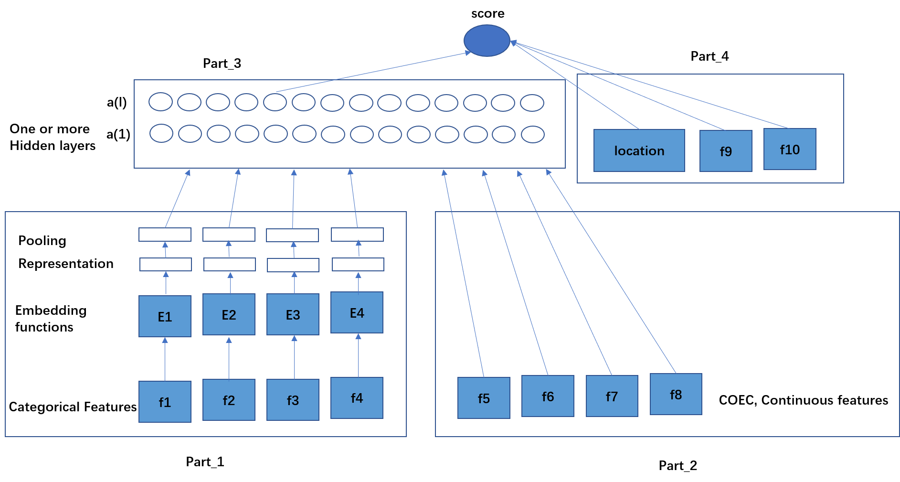

# 用户行为序列在搜索广告CTR预估场景的探索与实践
## 一、前言
&emsp;用户点击率预估在在线广告系统中一直担任着非常重要的角色，其主要用于刻画用户意图在当前上下文场景中和候选广告的相关性，并以此作为广告排序的参考依据。在美团搜索广告系统的场景中，每当用户意图触发了一次搜索请求，其产生的搜索关键词首先会经过召回模块得到粗选的候选广告集合。随后下游的预估模块和机制模块会对该候选广告集合进行最终排序。

&emsp;CTR预估任务在预估模型中执行，其本质上是二分类问题，可以使用机器学习来解决。典型的学习方法包括逻辑回归、贝叶斯probit回归、GBDT、FM等。随着深度学习技术在近几年不断发展和普及。基于深度学习的CTR预估模型逐渐顺势在各大广告系统中取代传统机器学习模型，且得到广泛应用。在初期，Google提出wide&deep模型及其基于embedding&MLP的学习方式深受喜爱，之后业内大部分创新迭代工作也都是从Embedding&MLP方法延伸而来。核心思想是将原来one-hot/multi-hot表示的高维稀疏特征映射成一个固定长度的低维稠密向量，然后再把所有特征向量拼接起来作为MLP网络的输入来学习高阶的非线性关系。然而，对于某些特殊的特征，例如我们使用用户历史点击/下单的POI序列来刻画用户偏好，最基本做法是将行为序列中每个POI的相关属性通过Embedding的方法进行映射并通过pooling方式聚合。然而这么做存在一些不足，一方面没有利用到这个特征的时序信息；另一方面，包括噪声行为在外，模型无法区分序列中不同行为的权重。受用户行为特征的重要作用所驱动，近两年行业内不断涌现出基于用户行为序列建模的方法来改进上述问题，主要包含对以下两个方面信息的刻画：

* 时序信息：当序列信息较为丰富时，常见做法是使用基于RNN的网络结构对行为序列建模；或者在每个序列单元中加入时序相关的偏差（Positional Encoding）；也可以对序列进行Session结构化，然后在使用前面的方式建模。
* 相关性权重：在不同建模阶段引入注意力机制（Attention）来学习序列行为的表达权重。例如，在用户序列中加入了与候选广告的attention权重来自适应地学习用户兴趣在不同场景的表达；与借鉴于NLP场景中的self-attention思想来区分不同行为的权重；结合了RNN以及attention机制在自身业务场景上进行了不同形式的创新。主要包括模型建模、实验评估以及性能优化等部分。

## 二、模型建模
&emsp;在进行行为序列模型迭代之前，美团搜索广告场景的预估模型主要基于WDL结构，part_1主要对离散型特征及部分离散化后的连续型特征进行低维稠密的向量化映射，并在之后使用适当的pooling方式进行聚合；part_2主要针对连续型特征，直接与part_1的最后一层拼接在一起做信息融合，随后输入到part_3（MLP）；part_4是模型的“Wide”部分，主要包括曝光位置等记忆性较强的特征。

搜索广告CTR预估模型WDL网络结构图

&emsp;针对用户行为序列特征建模的迭代，美团搜索广告场景的探索迭代路线为：Pre-trained Cont.Feature -> E2E + Avg Pooling DIN -> Transformer-based WDL DIEN  -> Session-based WDL。最初采用预训练的方式，选取Word2Vec模型单独对用户行为序列进行建模，生成行为的embedding表示，并将其加入到模型part_2部分，这次迭代带来了超过基线1.4%的离线AUC和线上CTR的提升。然而，采用预训练的方式虽然能够将复杂的序列建模从CTR预估模型里抽离出来进而提高线上预估效率，但后续在序列模型的迭代和更新方面引入一系列难题。于是我们将迭代重心转为端到端的训练方式，在美团点评双侧先后探索DIN、DIEN以及基于Transformer等模型的预估效果。这三个模型的比较总结如下：

<table>
    <tr>
        <td>模型</td>
        <td>序列建模增加的参数量</td>
        <td>各自特点</td>
        <td>相似之处</td>
    </tr>
    <tr>
        <td>DIN</td>
        <td>$O(Q * k * ff_{DIN})$ Q为一个行为结构体中的属性实体个数；k为一个属性实体映射到embedding的维度；ff_DIN为attention全连接网络第一层单元数</td>
        <td>(1) 模型结构相较起来最为简单。(2) Attention的权重基于与候选广告embedding先进行简单拼接和运算后接入一个前向网络得到，并以此对行为序列进行加权求和</td>
        <td rowspan="3">使用用户历史点击过的POI作为一个行为结构体，包含该POI的属性实体（如类目、地理位置等）以及行为本身的属性（如时间）；都应用了注意力机制，使用候选广告反向激活序列行为；MLP层的激活函数都没有使用常用Relu，分别采用改进后的激活函数</td>
    </tr>
    <tr>
        <td>DIEN</td>
        <td>$O(M^{2} + M *(ff_{auxiliary} + ff_{attention})), M=Q*K$ $ff_{auxiliary}$为auxiliary全连接网络第一层单元数；$ff_{attention}$为attention全连接网络第一层单元数</td>
        <td>使用GRU单元来对点击序列进行建模，以此刻画时序信息；引入附加损失，使用第一层GRU输出的状态来预估预估行为，并计算附加损失的梯度来对属性实体embedding参数进行更新</td>
    </tr>
    <tr>
        <td>BST</td>
        <td>$O(M^{2} + M * ff_{transformer}), M=Q*k$，其中为a$ff_{transformer}$为Encode中FFN第一层单元数</td>
        <td>在行为结构体重加入positional encoding，以此来表达序列时序信息；采用transformer中Encoder模块，将候选广告POI实体与所有行为序列POI实体拼接起来输出到Encoder；序列之间以及序列与候选广告之间都会进行注意力机制的加权</td>
    </tr>
</table>

### Session-based WDL
&emsp;我们在探索DIN和DIEN是，模型使用的序列长度上限为30，迭代过程中，虽然DIEN模型的效果在实验中表现十分出色，并且观察到随着序列长度上线的增加，模型离线AUC也会得到相应提升，但模型的性能开销会随之成倍增加（详见实验评估部分）。这个现象在阿里妈妈的定向广告场景同样存在。为了在序列建模过程中使用更丰富的序列信息，同时兼顾线上线下性能开销，我们对原有的WDL网络结构进行Session序列建模模块的扩展。对此，我们将用户相邻时间的原始行为序列进行了Session结构的拆分，拆分的步骤如下：
* 在数据层面上，确保任意一个session内用户相邻行为之间不超过30分钟。
* 在通过时间划分好的Session序列上设置窗口大小[L, P]，对训练样本的session个数以及每个session内的原始序列长度分别做最大限制为L和P的截断，不足的部分会做padding；截断原则是优先选择最接近曝光时间的部分。窗口大小[L, P]为模型在对不同业务流量建模是需要适配该业务数据分布的超参数，尽可能提高窗口内原始行为序列的填充率，即减少padding的个数。

&emsp;通过合理的窗口大小限制，session结构化后的序列长度会远小于原始的序列长度，从而大大减小了后续使用序列进行建模的复杂度。除此之外，采用session结构化建模的另一个重要原因是，我们发现在业务场景中，大部分用户的点击行为在同一个session内部具有较强同质性，并在不同session内具有较强同质性。以点评侧训练样本的用户行为数据为例，选取内部序列长度大于1的session进行统计，session之间的一/二级品类的个数明显大于session内部的个数

<table>
    <tr>
        <td>Session内部行为个数</td>
        <td>Session内部行为一级品类个数</td>
        <td>Session内部行为二级品类个数</td>
        <td>不同Session行为一级品类个数</td>
        <td>不同Session行为二级品类个数</td>
    </tr>
    <tr>
        <td>均值</td>
        <td>6.1</td>
        <td>1.41</td>
        <td>2.52</td>
        <td>4.84</td>
        <td>12.25</td>
    </tr>
    <tr>
        <td>中位数</td>
        <td>4</td>
        <td>1</td>
        <td>2</td>
        <td>5</td>
        <td>12</td>
    </tr>
</table>

&emsp;建模时，我们将用户的原始行为序列表示为$B = [b_{1};b_{2};...,b_{i},...,b_{T}]$，序列中每个节点$b_{i}$为一个行为结构体。在选取行为结构体中的实体属性时，尽可能在各方面来表达一个用户的点击行为（图3，灰色部分），除了场景POI品类和地理位置等属性外，受BST模型启发，我们把当前请求和历史行为发生的时间差作为一个行为的属性实体来表达时序信息（Positional Encoding），获得显著成效。目前来看，对行为结构体属性的刻画仍是一个可以继续深耕的方向。整个原始行为序列B首先经过Embedding Layer映射为$E_{B} = [b_{e_{1}};b_{e_{2}};...,b_{e_{i}};...,b_{e_{T}}] \in R^{Q*k}$，如图2，随后输入到Session Pooling Layer，基于事先划分好的session结构进行原始行为表征聚合。聚合的方式比较灵活，考虑到session内部数据同质性强的特点，采用average pooling方式不会造成过多信息丢失，同时能降低计算复杂度。

&emsp;Pooling聚合后的行为序列与Session Bias Encoding进行拼接得到完整的Session序列特征。Session Bias包含session在序列中的相对位置、session所处的时间段/日期、原始行为个数、原始行为是否包含候选广告的地理位置、原始行为是否包含候选广告类目、原始行为是否包含候选广告ID本身等，这些属性是在session粒度上独有的表征，一方面加强了每个session行为的表达能力；从另一方面思考，额外增加的session粒度的信息还能够填补pooling时信息损耗。最终得到session序列表达形式为：
$$E_{s} = Concat(E_{p},E_{c}),$$
$$E_{p} = [s_{e_{1}};s_{e_{2}};...,s_{e_{i}};...,s_{e_{T^{'}}}] \in R^{Q*K}$$
$$E_{c} = [c_{e_{1}};c_{e_{2}};...,c_{e_{i}};...,c_{e_{T^{'}}}] \in R^{Q*K}$$
$$s_{e_{1}} = Pooling([b_{e_{1}};...;b_{e_{N_{s1}}})$$
$$s.t. N_{s_{1}} \leq L, T \leq P, T \leq T$$

其中Q为原始序列行为结构体的属性实体个数，Q为bias个数，k为embedding大小，$N_{s_{1}}$为第一个session内部的原始行为序列个数，T为原始行为序列长度，T为session序列长度。

&emsp;拼接好的session序列$E_{S}$接下来会进行多级attention激活，同时输入到三个不同注意力单元（Attention Unit1 & 2 & 3）进行加权，其结构图如下：
* Attention Unit1：使用候选广告对用户历史行为进行反向激活，表达用户兴趣的多样性。
* Attention Unit2：与搜索关键词相关信息激活得到注意力权重，使得不同的session行为对于不同的用户意图能够自适应地表达。
* * Attention Unit3：与上下文场景激活得到注意力权重，使得不同的session行为对于不同的上下文环境能够自适应地表达。

&emsp;基于三个注意力单元，Session-based WDL模型在序列建模方面增加的参数量远远低于DIEN和BST，为：$O(Q * K * (ff_{attention1} + ff_{attention2} + ff_{attention3}))$，总的来说，Session-based WDL模型在序列建模的优势在于更高效地应用长序列行为特征进行建模，并且根据业务场景提炼出session结构化后独有的特征来进一步提高模型预估效果。目前，美团点评双侧的主要业务流量都已陆续将此模型全量。

## 三、实验与评估
&emsp;由于不同的序列模型在各个业务线上的效果有所差异，本章节的对比实验室以点评APP到餐和到综的筛选列表页为例进行分析
### 1. 实验设置
#### 数据来源
美团点评双侧都采用全APP的实时数据流，从中获取用户从请求当前截止到最近90天的原始点击行为序列，随后按照上述规则进行切分后得到session结构化序列。
#### 实验超参
<table>
    <tr>
        <td>ps</td>
        <td>worker</td>
        <td>训练天数</td>
        <td>Epoch</td>
        <td>学习率</td>
        <td>负采样比例</td>
        <td>Batch Size</td>
        <td>MLP结构</td>
        <td>embedding大小（k）</td>
    </tr>
    <tr>
        <td>2</td>
        <td>16</td>
        <td>90</td>
        <td>2</td>
        <td>0.0005</td>
        <td>0.2</td>
        <td>5000</td>
        <td>1024512256</td>
        <td>8</td>
    </tr>    
</table>

对照组
* WDL：图一结构
* E2E：在WDL结构基础上，将序列行为的各个属性实体分别用作不同的sparse特征，多个行为得到的embedding使用average pooling聚合后直接作为part_3(MLP)的输入
* DIN：ff_DIN=16
* BST：额外增加时间差属性实体作为positional encoding，head=1（为2时效果与1相近，但耗时增加明显）；ff_transformer=128
* DIEN：简化原文网络结构，去掉附加损失部分，仅使用单层GRU单元，并使用与候选广告的注意力权重来控制GRU输出。

### 2. 效果指标
#### 离线评估
离线以AUC和训练时长为指标，分别在不同的序列长度/session窗口大小的设置下进行对比，结果如下表，发现：
* 全APP实时流中的用户行为特征作用明显，仅embedding+average pooling的使用方式就能显著提高预估auc，在到餐和到综流量上分别提升0.81%和0.25%；
* DIN的反向激活单元能够进一步提升模型效果，但与E2E组一样，由于没有考虑时序信息，增加序列长度对模型效果提升不明显。
* 对于相同序列长度，DIEN和BST都打败DIN，且序列长度对模型效果提升明显，以DIEN为例，当使用序列长度由30增加到75时，预估auc有显著提升，但训练及预估耗时也成倍增加，由于考虑时序信息的方式不一样，序列长度不同时，两者的表现存在差异；
* session-based WDL用了相比DIEN和BST更短的耗时，达到了更好地效果，且当采用的原始序列长度越长时，其耗时的优势就更明显。另外，session窗口的选取十分重要，同样是上限为75长度的窗口，25*3相比15*5用了较短的耗时获得了更高的AUC。

<table>
    <tr>
        <td>组</td>
        <td>序列长度/session窗口</td>
        <td>训练时长(mins)</td>
        <td>预估时长(sec/batch)</td>
        <td>到餐auc diff</td>
        <td>到综auc diff</td>
    </tr>
    <tr>
        <td>WDL</td>
        <td>-</td>
        <td>170</td>
        <td>0.220</td>
        <td>-</td>
        <td>-</td>
    </tr>  
    <tr>
        <td rowspan="2">E2E</td>
        <td>30</td>
        <td>180</td>
        <td>0.298</td>
        <td>+0.81%</td>
        <td>+0.28%</td>
    </tr>  
    <tr>
        <td>75</td>
        <td>180</td>
        <td>0.326</td>
        <td>+0.86%</td>
        <td>+0.32%</td>
    </tr>    
     <tr>
        <td rowspan="2">DIN</td>
        <td>30</td>
        <td>240</td>
        <td>0.410</td>
        <td>+1.02%</td>
        <td>+0.48%</td>
    </tr>  
    <tr>
        <td>75</td>
        <td>320</td>
        <td>0.686</td>
        <td>+1.08%</td>
        <td>+0.54%</td>
    </tr>
     <tr>
        <td rowspan="2">DIEN</td>
        <td>30</td>
        <td>380</td>
        <td>0.810</td>
        <td>+1.16%</td>
        <td>+0.54%</td>
    </tr>  
    <tr>
        <td>75</td>
        <td>630</td>
        <td>1.043</td>
        <td>+1.53%</td>
        <td>+0.71%</td>
    </tr>    
    <tr>
        <td rowspan="2">BST</td>
        <td>30</td>
        <td>350</td>
        <td>0.606</td>
        <td>+1.25%</td>
        <td>+0.58%</td>
    </tr>  
    <tr>
        <td>75</td>
        <td>630</td>
        <td>1.147</td>
        <td>+1.40%</td>
        <td>+0.64%</td>
    </tr>    
    <tr>
        <td rowspan="3">Session-based WDL</td>
        <td>10.3</td>
        <td>200</td>
        <td>0.327</td>
        <td>+1.32%</td>
        <td>+0.68%</td>
    </tr>  
    <tr>
        <td>15*5</td>
        <td>300</td>
        <td>0.422</td>
        <td>+1.50%</td>
        <td>+0.79%</td>
    </tr> 
    <tr>
        <td>25*3</td>
        <td>270</td>
        <td>0.393</td>
        <td>+1.61%</td>
        <td>+0.86%</td>
    </tr>        
</table>

#### 在线评估
在线A/B实验的实验组和对照组分别为Session-based WDL与WDL模型，在为期一周小流量实验中，实验组模型的线上CTR与RPS（Revenue Per Search）相交对照组显著提升。
<table>
    <tr>
        <td></td>
        <td>CTR DIFF</td>
        <td>RPS DIFF</td> 
    </tr>
    <tr>
        <td>到餐流量</td>
        <td>+4.3%</td>
        <td>+3.32%</td> 
    </tr>
    <tr>
        <td>到综流量</td>
        <td>+1.58%</td>
        <td>+1.62%</td> 
    </tr>
</table>

#### 主要模块效果
在点评筛选流量中，Session-based WDL模型的优化效果除了来自于行为序列特征本身，下面几个模块发挥了不同程度的作用，通过实验表明，positional encoding与session bias带来的作用最为突出；除此之外，各个attention单元也能对模型的预估效果带来明显提升。
<table>
    <tr>
        <td>删减模块</td>
        <td>到餐auc diff</td>
        <td>到综auc diff</td> 
    </tr>
    <tr>
        <td>Attention Unit 1（With Context）</td>
        <td>-0.1%</td>
        <td>-0.04%</td> 
    </tr>
    <tr>
        <td>Attention Unit3（With Target Ads）</td>
        <td>-0.08%</td>
        <td>-0.11%</td> 
    </tr>
    <tr>
        <td>Attention Unit3（With Target Ads）</td>
        <td>-0.08%</td>
        <td>-0.11%</td> 
    </tr>
    <tr>
        <td>positional encoding</td>
        <td>-0.43%</td>
        <td>-0.25%</td> 
    </tr>
    <tr>
        <td>Session bias</td>
        <td>-0.22%</td>
        <td>-0.35%</td> 
    </tr>
</table>

* 参考链接：
    * https://zhuanlan.zhihu.com/p/78365283
    * https://www.jianshu.com/p/de51ec770572