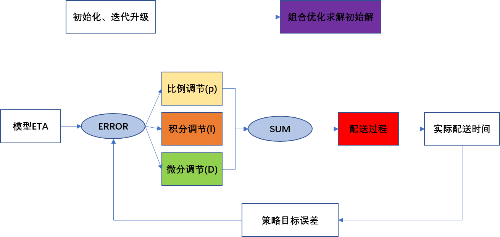
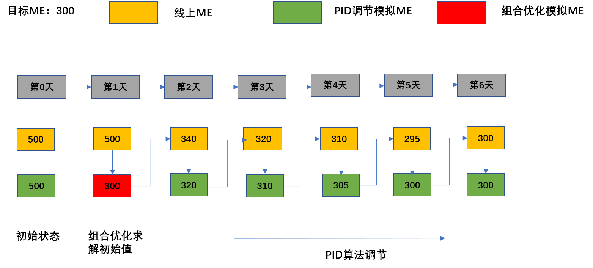

# ETA反馈调节方案
## 1. 项目概要
### 1.1 项目背景
&emsp;ETA是配送系统中非常重要参数，与用户体验、配送成本有直接关系，而且在直接影响调度系统和定价系统的最终决策。目前专送ETA的策略框架分为模型部分（基模型、长尾模型）+补时环节（负载、距离、价格、出餐）两个独立部分。目前看了，现有框架存在以下问题：
* 补时环节使用固定参数，无法自动适配模型的迭代升级、环境的动态变化以及策略目标的迁移。
* 补时环节内部、补时环节与模型预估之间存在效果叠加但优化相互独立问题，无法实现全局最优。

&emsp;综上，专送ETA各个环节需要进行统一考虑以应对上述问题。

### 1.2 项目目标
&emsp;设计一套自适应的时间修正模块：
* 补充修正模型预估不佳的运单（场景）效果。 
* 自适应环境变化、模型升级以及策略目标迁移（当前策略目标为优化ME）。

### 1.3 项目收益
1. 时间修正算法化：可以快速、准确且稳定调节ETA（根据反馈调节模拟记录估计：整体ME缩短0.5分钟，预估55分钟比例下降0.6pp；ME偏高的部分（高负载和高价格）ME下降3-4分钟，预估超55分钟比例下降6-12pp）
2. 解耦模型和策略目标：模型部分可以只以准（MAE最小）为目标，不再提供有偏预估。

## 2. 方案选型
### 2.1 方法调研
&emsp;目前遇到的问题主要是参数自适应的问题，现有分析可知，模型预估在特殊场景（长距离、高负载）的表现比较差。因此，这里选择将修正维度定义成各个场景（如：负载、价格、距离、出餐、交付、恶劣天气）。进一步分析可知，问题的本质是找到模型预估和策略目标相差较大的多个场景，并根据差距的大小，自动对相应场景的预估值进行调整。经过调研，目前解决参数自适应的方案主要可划分为：基于控制理论的方案与基于组合优化的方案。
<table>
    <tr>
        <td>方案</td>
        <td>基于控制理论的方案</td>
        <td>基于组合优化的方案</td>
    </tr>
    <tr>
        <td>描述</td>
        <td>把参数对应为控制量，通过PID等控制算法，控制最终指标在某个最优化的值</td>
        <td>把问题对应成组合优化问题，离线通过最优化方法求解全局最优，并应用于线上。</td>
    </tr>
    <tr>
        <td>迁移</td>
        <td>参数包括各个场景，各个分段的系数。通过PID算法闭环反馈控制策略指标（如ME）至某个最优值（如-6）</td>
        <td>变量包括各个场景、各个分段的系数。通过遗传算法、模拟退火算法等搜索最优的场景系数</td>
    </tr>
    <tr>
        <td>优点</td>
        <td>可以较好的解决自适应调节的问题，且可以保证各个场景下调整的稳定性</td>
        <td>收敛速度快，一次迭代即可实现离线最优</td>
    </tr>
    <tr>
        <td>缺点</td>
        <td>收敛速度较慢，需要多次调整才能达到相对稳定的状态，多个场景交叉，存在多变量控制问题。</td>
        <td>需要有明确的自变量与因变量的映射关系</td>
    </tr>
     <tr>
        <td>参考</td>
        <td>https://zhuanlan.zhihu.com/p/140933417     </td>
        <td>组合优化方案</td>
    </tr>
</table>

### 2.2 最终技术选型和选择逻辑
&emsp;考虑到ETA与线上ME映射关系不明确（线上给定不同ETA，实际送达时长也会改变）。离线基于组合优化的结果并不能保证线上的最优性，但同时考虑到离线ME与线上ME有比较强的相关性，也可以利用组合优化来实现更快收敛。故而，本方案采用组合优化+反馈控制的方案：
* 首选通过组合优化（离线）的方法求取一个初始解，然后通过反馈控制（离在线）持续优化。
* 面对环境迁移，反馈控制可以较好且逐渐调整至最优。
* 面对较大的模型迭代与目标迁移，也可先通过足额优化求取初始解后上线，最终实现在线策略效果最优。

## 3. 总体设计
### 3.1 名词解释
&emsp;PID(Proportion Integral Differential)算法是一种反馈调节算法，以比例调节、积分调节、微分调节为手段，将输入值逐步调节到目标值。其中：
* p表示比例调节，关注绝对误差。
* l表示积分调节，关注稳态误差。
* D表示微分调节，关注减少震荡。

PID调整公式为：
$$U(k) = K_{p} * err(k) + K_{i} * \sum err(k) + K_{d}(err(k) - err(k-1)) $$

### 3.2 整体架构设计

图1 ETA反馈调节

如上图所示，整体架构分为两个模块离线初始化、离在线PID：
* 出现初始上线、模型更新、策略目标迁移等情况时，使用离线组合优化求解初始解。
* 日常迭代使用离在线PID进行反馈调整。

以ME目标为300为例，迭代过程可能如下图：

图2 ME迭代

## 4. 算法详细设计
### 4.1 场景划分
&emsp;场景是控制与组合优化的调控单元
#### 4.1.1 场景维度
<table>
    <tr>
        <td></td>
        <td>数据分析</td>
        <td>自动识别</td>
    </tr>
    <tr>
        <td>说明</td>
        <td>通过业务分析进行人工设置</td>
        <td>自动发现模型预估和策略指标相差较多的维度</td>
    </tr>
    <tr>
        <td>示例</td>
        <td>距离、负载、出餐、价格、交付等。</td>
        <td></td>
    </tr>
</table>
为了简化且保持预估系统稳定性，目前选择业务分析设置的方式进行场景维度（距离、负载、出餐、价格）

#### 4.1.2 场景划分
<table>
    <tr>
        <td></td>
        <td>场景正交</td>
        <td>场景融合</td>
    </tr>
    <tr>
        <td>说明</td>
        <td>多个场景划分后通过正交组合，相互独立</td>
        <td>多个场景线性组合</td>
    </tr>
    <tr>
        <td>示例</td>
        <td>系数1：距离 < 1000 且 负载 < 2 且 出餐 > 20 且 价格 > 100；系数2：距离 < 1000 且 负载 < 2 且 出餐 > 20 且 价格 < 100；</td>
        <td>系数1：距离 < 1000；系数2：距离 > 1000</td>
    </tr>
</table>
由于正交场景容易出现极端系数的情况，在稀疏场景中运单较少，离线数据观察调节波动太大，所以最终使用场景融合的方式。

## 4.2 组合优化
<table>
    <tr>
        <td>问题描述</td>
        <td>针对多个互有交集的运单场景，如何通过ETA调整，使得各场景运单的ETA满足策略目标，如：ME</td>
    </tr>
    <tr>
        <td>策略输出</td>
        <td>每个场景下的调整参数</td>
    </tr>
    <tr>
        <td>优化目标</td>
        <td>$argmin \sum f_{target} (ETA, ATA)$</td>
    </tr>
    <tr>
        <td>约束条件</td>
        <td>minLimit_{i} <= coef_{i} < maxLimit_{i}, i=0,1,2,3...</td>
    </tr>
    <tr>
        <td>变量描述</td>
        <td>ETA：预计送达时间；ATA：实际配送时间；f_{target}：策略目标函数；minLimit：参数最小值；maxLimit：参数最大值；coef_{i}：场景i的调整参数</td>
    </tr>
    <tr>
        <td>优化方案</td>
        <td>领域搜索算法</td>
    </tr>
</table>

## 4.3 PID反馈
### 4.3.1 在线调整
* 获取模型部分预估ETA
* 读取离线计算的时间修正因子
* 根据时间修正因子和对应的场景特征计算ETA调整值 = 系数 * 特征
* 输出最终ETA = 模型ETA + ETA调整值 
### 4.3.2 离线反馈
* 获取各个场景指标数据，并计算误差。
* 通过PID计算调整后系数
* 保持离线调整结果

### 4.3.3 多变量控制
&emsp;根据对自控的调研[工程PID算法参数整定串级PID算法讲解](yanjuntech.cn/archives/172)、[飞控算法中双环串级PID如何理解](https://www.zhihu.com/question/293450508)，目前对多变量控制的常见方式是串级pid，即每次只调节一个控制器。所以，这里也采用每次只调节一个控制器，即一个场景模块（距离、价格、负载、出餐）的方式进行多变量控制，后续可以采用同时调节多个控制器的方式，[PID控制的不足，多变量控制来补](https://zhuanlan.zhihu.com/p/29443963)进行。

### 4.3.4 参数整定
&emsp;这里我们通过离线数据分析选择一组参数（$K_{p}=0.0005、K_{i} = 0.0001、K_{d} = 0$），线上观察调整的方式进行参数整定。

# 6 工程详细设计
### 6.1 功能设计
* 线上应用方案：在线上计算时，通过城市维度离线特征的方式获取调节参数。
* 表结构：
<table>
    <tr>
        <td>字段名</td>
        <td>说明</td>
        <td>类型</td>
    </tr>
    <tr>
        <td>dt</td>
        <td>日期</td>
        <td>string</td>
    </tr>
    <tr>
        <td>City_Dim</td>
        <td>维度值</td>
        <td>string</td>
    </tr>
    <tr>
        <td>time_adjustment_thresholds</td>
        <td>时间调整特征阈值</td>
        <td>string</td>
    </tr>
    <tr>
        <td>time_adjustment_coefficient</td>
        <td>时间调整参数</td>
        <td>string</td>
    </tr>
    <tr>
        <td>time_adjustment_bound</td>
        <td>时间调整范围</td>
        <td>string</td>
    </tr>
</table>

### 6.2 非功能设计
日志记录：
<table>
    <tr>
        <td>字段名</td>
        <td>说明</td>
    </tr>
    <tr>
        <td>time_adjustment_thresholds</td>
        <td>时间调整特征阈值</td>
    </tr>
    <tr>
        <td>time_adjustment_coefficient</td>
        <td>时间调整参数</td>
    </tr>
    <tr>
        <td>time_adjustment_bound</td>
        <td>时间调整范围</td>
    </tr>
    <tr>
        <td>adjust_times</td>
        <td>每个场景调整值</td>
    </tr>
    <tr>
        <td>adjust_features</td>
        <td>每个场景值</td>
    </tr>
</table>

## 7 评估方案
### 7.1 业务评估指标
<table>
    <tr>
        <td>指标类别</td>
        <td>指标</td>
        <td>说明</td>
    </tr>
    <tr>
        <td>核心指标</td>
        <td>ME、实际超过55分钟比率、8分钟准时率、预估超55分钟率</td>
        <td>1. 预估超55分钟率：（预计送达时间-用户支付完成时间）> 55min完成单 / 总完成单量；2. ME：（预计送达时间-运单完成时间）/ 完成单量；3. 8分钟准时率：（运单完成时间-预计送达时间）小于等于8min的完成量 / 总完成量；4. 配送超过55分钟率：（运单完成时间-用户支付完成时间）>55min完成单 / 总完成单量</td>
    </tr>
    <tr>
        <td>观察指标</td>
        <td>单均ETA、单均配送时长</td>
        <td>1. 单均ETA：（预计送达时间-运单完成时间）/ 完成单量；2.单均配送时长：(运单完成时间-用户支付完成时间) / 完成单量 </td>
    </tr>
</table>

### 7.2 算法评估指标
<table>
    <tr>
        <td>指标类别</td>
        <td>指标</td>
        <td>说明</td>
    </tr>
    <tr>
        <td>核心指标</td>
        <td>调整时间、稳定性</td>
        <td>调节时间：响应到达并保持在目标值±5%(或者±2%)内所需的最短时间</td>
    </tr>
    <tr>
        <td>观察指标</td>
        <td>补时时长</td>
        <td>补时时长：各个维度算法模块补时时长</td>
    </tr>
</table>

### 7.3 评估方式
AB实验方法：实验组（反馈调节方案），对照组（目前线上方案）

## 8 稳定性保障
### 8.1 风险点梳理
某些场景下实际配送时长和ETA关系发生突变（变得特别大/特征小）

### 8.2 降级和效果不佳预案
开始 =》 降级 =》当前线上调整版本(Y) / 反馈调节版本(N)

### 8.3 稳定性保障check表
技术方案的稳定性设计要求：可监控、可灰度、可回滚

## 9 未来规划
### 9.1 更好的调节
1. 调节模块的更新粒度可以做到实时，即：如果个别场景预估效果较差，可以更快的对这部分场景进行调整。
2. 场景自动探索功能，自动发现预估和策略目标相差较多的场景。
3. 将目前的补时策略收口到修正模块中。

### 9.2 更广的应用
本方案可以较好的将模型目标和策略目标解耦，即：模型只负责预估准，调整模型负责对预估值进行调整以适配策略的目标。所以可以在模型目标和策略目标不一致/策略目标变化频繁的场景使用该方案，是的模型更容易适配策略。
