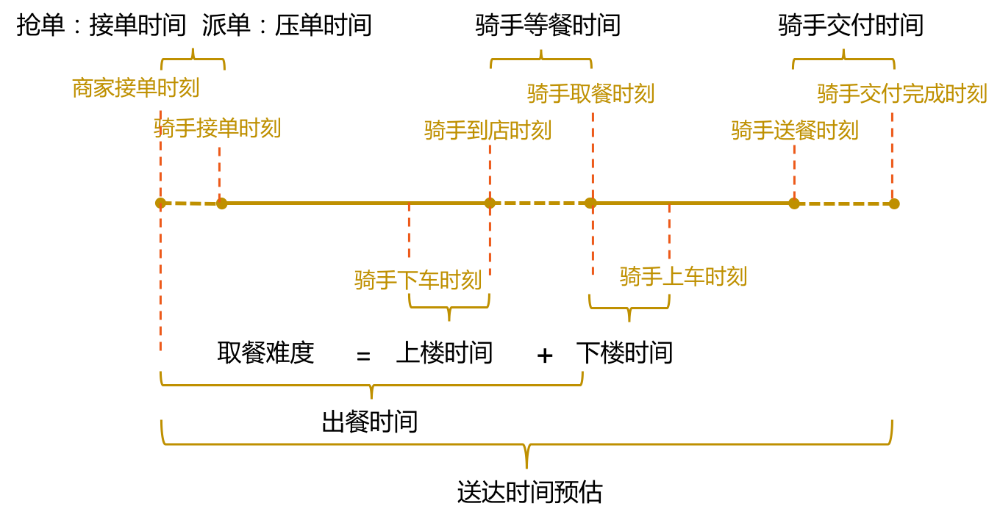
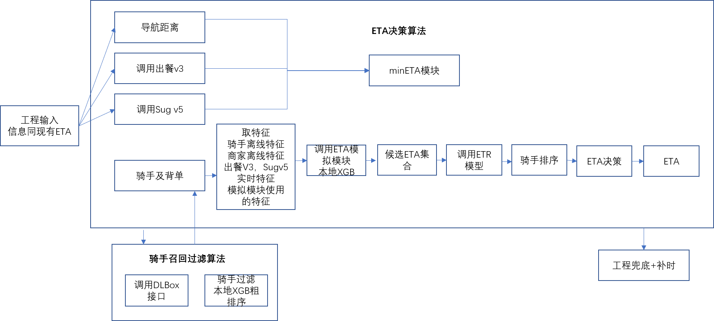
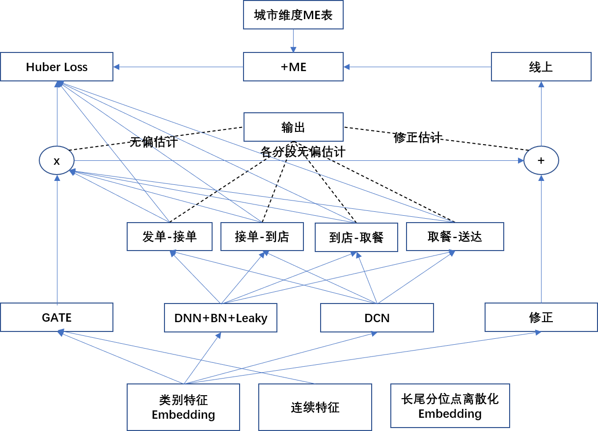

# ETA梳理
## 一、概念
&emsp;ETA：预计送达时间，外卖配送算法团队，基于大数据系统考虑用户、商户、运力、距离、品类、餐品、城市、路况、时段、天气等等方面信息，综合性智能性动态预估出来的结果，另外跑腿业务也有ETA相关设计。

&emsp;ME： 预计配送时长-实际配送时长，一般为正值，ME越小表明ETA越紧张，越大表明越宽松，ME的值和相对准时率挂钩，通常ME越大，准时率会相对越高。

&emsp;为什么要提高ETA？
* 提高下单客户用户体验，ETA的值是否合理直接影响用户下单、效率和体验。
* 司机考核，客户对履约时效的要求是敏感的，合理的ETA会给司机足够的紧迫感，否则可能会导致配送效率降低以及用户体验恶化，降低竞争力。

# 二、背景
&emsp;在配送场景下，骑手交付时间即骑手到达用户附近下车后，多久能送到用户手中，是一个很重要的环节，下图是一个订单在整个配送链路的时间构成，时间轴最右部分描述了交付环节在整个配送环节中的位置，交付时间衡量的是骑手送餐时间的交付难度，包括从骑手到达用户楼宇附加，到将餐品交付到用户手中的整个时间。

图1 配送时间链路

&emsp;交付时间是这个困难度的直接衡量，骑手在送餐交付到用户手中时会碰到不同的问题，例如：骑手一次送餐到楼宇内多个用户、骑手对特定楼宇寻址特别困难，骑手在交付楼宇附近只能步行，老旧小区没有电梯，写字楼无法上楼或者难以等到电梯等等。交付时间预估需要具备刻画交付难度的能力，其作为一种交付难度的刻画，在定价、调度等多个场景广泛使用。例如根据交付难度来确定是否调节骑手邮资，根据交付难度来确定是否调节配送运单的顺序避免超时等，交付时间预估是配送业务基础服务重要一项。交付时间预估存在如下困难：
* 输入信息较少，且多为非数值型数据，目前能够被用来预估的特征仅如下维度：交付地址、交付点的经纬度、区域、城市、适配常规机器学习模型需要重新整理且容易丢失信息
* 计算性能要求较高，由于被大量服务调用，需要性能TP99在10ms以内，整个算法平均响应时间需要控制在5ms内，其中包括数据处理及rpc的时间，该标准为cpu环境下的性能要求。

# 三、目标
&emsp;在运力和准时率的限制下，给予用户最短的预计送达时间。

# 四、介绍
## 4.1 模型介绍
&emsp;ETA是美团平台机器学习基于订单维度产生的预估结果，预估基于：订单配送距离、订单配送难度（客单价、交付难度、取货难度），商家出餐情况、区域运力压力，过去14天相似情况下的实际送达时长等等。
&emsp;现有逻辑下，先会根据ML输出一个基础的预估时长，然后从单独的4大补时模型中输出叠加补时（高客单价、出餐慢、远距离、高负载）。
* 容易造成的问题：a. 叠加补时后ETA容易偏长 b. ETA预估也不考虑骑手路径先后顺序 c. 出餐模型预估准确程度带来ETA准确程度的波动。
* 未来针对解决方案：a. 快送距离因子调整（全量）、快送模型因子调整（全量）、偏差分布模型（已验证5城） b. 预调度算法（第一城试点） c. 出餐慢准召调整。

图2 ETA调度

图3 ETA模型推断流程

### 4.2 交付时长预估特征
* geohash7维度联系客户到交付时长相关统计量
* geohash7维度入离AOI时长相关统计量
* geohash7维度入离SUG100米时长相关统计量
* geohash7维度上下车间隔相关统计量
* aoi维度联系客户到交付时长相关统计量
* aoi维度联系客户到交付时长相关统计量
* aoi维度入离AOI时长相关统计量
* aoi维度入离SUG100米时长相关统计量
* aoi维度上下车间隔相关统计量
* aoi面积
* aoi地址
* aoi通行属性
* aoi类型
* aoi上楼方式

# 五、对比
<table>
    <tr>
        <td>方向</td>
        <td>配送</td>
        <td>打车</td>
    </tr>
    <tr>
        <td>时间定义</td>
        <td>商家做餐时间+骑手骑行时间+骑手交付上下楼时间+业务时间+导航时间</td>
        <td>导航规划时间+导航时间</td>
    </tr>
    <tr>
        <td>应用场景</td>
        <td>商家出餐预估时间、订单交付预估时间</td>
        <td>接单预估时间</td>
    </tr>
    <tr>
        <td>补时</td>
        <td>恶劣天气补时、拼团单补时、众包大金额订单补时</td>
        <td>无</td>
    </tr>
    <tr>
        <td>多源预估</td>
        <td>无</td>
        <td>图商+自建路径与订单历史时间距离调优</td>
    </tr>
</table>