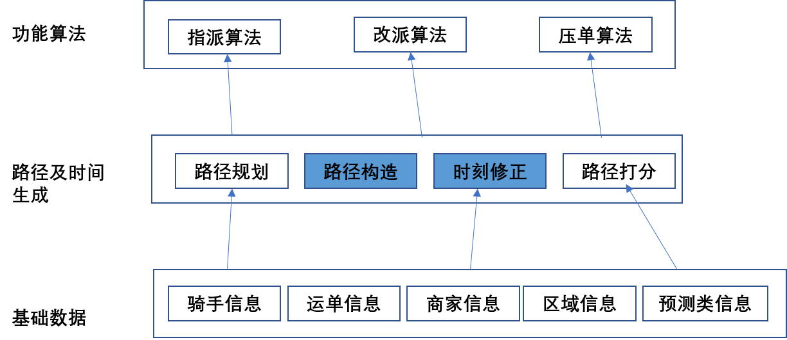
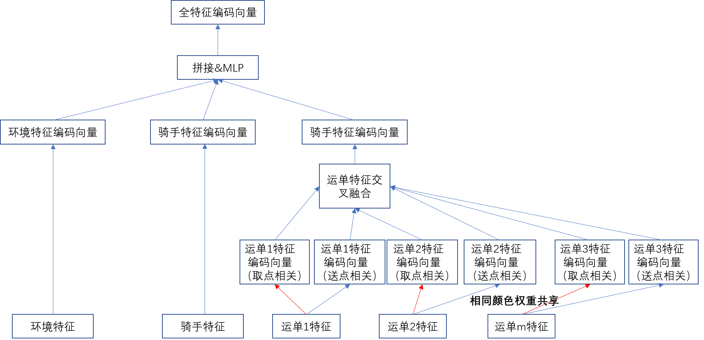
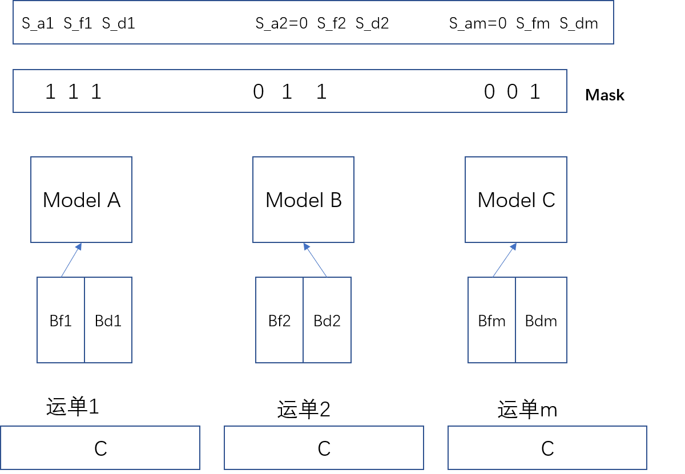
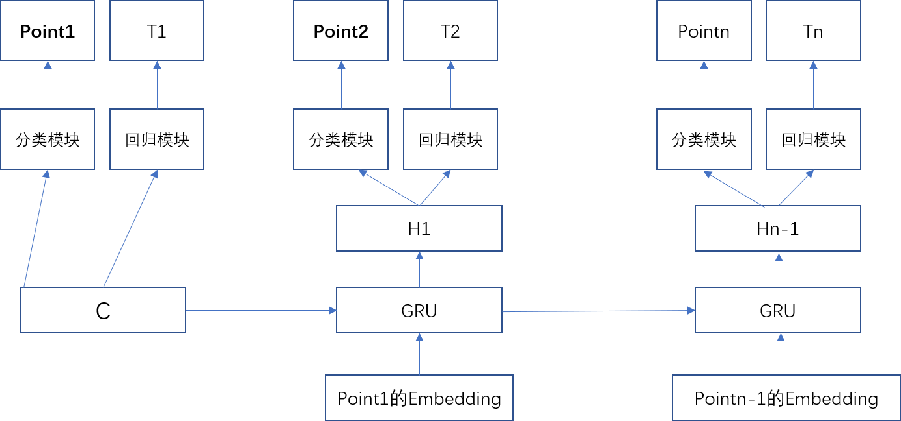
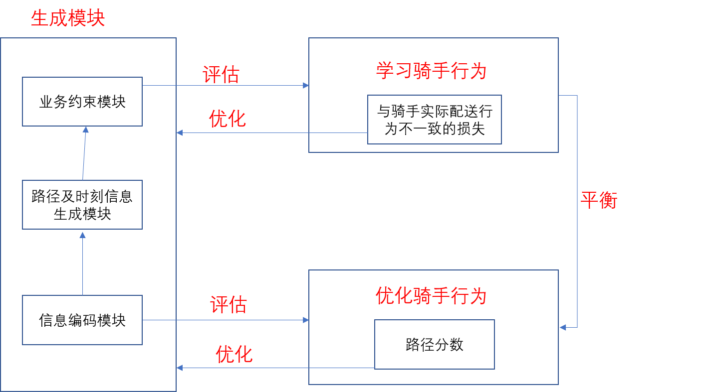

# ETR模型-深度学习在配送路径预估上的应用搜索
## 一、背景
### 1.1 什么是ETR
&emsp;ETR（Estimated Time of Route）指的是骑手的一条配送路径上的各个关键节点的预估时刻，关键节点包括取餐（入店、取餐、离店）和交付（入Sug、交付、离Sug）。在调度算法中，为骑手规划最佳的配送路径，并且预估路径上关键节点的时刻信息，用以知道派单和压单等功能算法。

图1 调度ETR

### 1.2 ETR的意义
&emsp;ETR预估的准确性直接影响到派单的决策，以交付时刻为例，如果交付时刻预估偏短，会导致准时率下降，如果预估过长，会导致配送效率降低。

### 1.3 ETR的目标
1. 当下：预估更准
* 运单交付时刻预估更准
* 运单等餐时长预估更准
* 路径一致率作为一个观察指标
2. 后续：生成效率更高的配送路径，结合业务引导骑手，进一步提升配送效率。

### 1.4 ETR的难点
* 预估准确性要求高
* 需要兼容路径的机理性约束（业务约束）
* 大规模并发计算，对计算性能要求高

### 1.5 演进过程

图2 ETR演进过程

## 二、ETR模型方案
### 2.1 整体架构
使用ETR模型直接预估骑手的配送路径和时刻，完全变成一个端到端的方案
* 准确性考虑：时间与路径顺序密不可分，作为一个预估问题，一起预估路径和时间会更准。
* 性能考虑：如果用路径规划模块生成路径顺序再使用深度模型预估时刻，计算性能一定不达标。

### 2.2 方案一
1. 具体方案
* 思路：对每个运单，关注其到店、取餐和交付时刻的预估（考虑需要路径顺序、交付时刻和到餐时长）；再由时刻生成路径顺序。
* 模型架构（编解码模型）
    * 编码器（Encoder）
        

        
图3 编码器1

    * 解码器：每个运单的到店、取餐和交付时长（距前一阶段），如果运单的某个阶段已经发生，则不考虑这个阶段。
        

        
图4 解码器1

* 路径修正：通过规则性修正使路径满足机理约束，整体的思想是尽少修正。
    * 取点修正：使同一个运单的到店和取餐时刻相连；
    * 速度修正：使骑手的速度不要过快；
    * 同店连续取餐修正。
2. 离线调研结果
* 交付时刻：与线上最终结果对比：MAE下降29.16s，3min置信度+4.69pp。与XGB模型相比：MAE下降20.87s，3min置信度+3.68pp。
* 等餐时长（与线上最终结果对比）：MAE下降98.55s，1min置信度+11.96pp。
* 路径一致率（与线上最终结果对比）：下降1.02pp

3. 目前进展
* 对专送骑手进行建模，已上线AB实验
* 线上模型效果已离线调研相当
* 对下游派单打分策略初步调整后的业务效果：准时率+0.25pp，人效提升1.47%，单均配送时长降低：32.81s，单均行驶距离/单均配送距离降低：2.29pp。

### 2.3 方案二
1. 具体方案
* 思想：显示对路径顺序进行预估建模
* 模型架构（编解码模型）
    * 编码器（Encoder）：运单间加入Multi-Head Self-Attention编码
    * 解码器（Decoder）
        

        
图5 解码器2

2. 离线调研结果
* 交付时刻：与线上最终结果对比：MAE下降32.21s，3min置信度+5.73pp。与XGB模型相比：MAE下降25.83s，3min置信度+6.70pp。
* 等餐时长（与线上最终结果对比）：MAE下降117.20s，1min置信度+11.35pp。
* 路径一致率（与线上最终结果对比）：上升1.58pp 
* 性能：比方案一慢一倍左右，相比方案一优势是显示对路径建模，模型表达能力强，可以提升路径一致率；劣势：模型训练难度较大，需要加入较多技巧，计算性能低。

### 2.4 方案三
1. 具体方案
* 思想：在预估的基础上引入最大化思想，生成效率配送更高的配送路径，同时结合业务引导骑手。
* 模型结构：应用监督学习刻画骑手的配送行为，帮助模型更好训练，应用强化学习解组合优化问题，生成效率更高的配送路径。（监督学习+强化学习）

        
图6 模型结构图

## 三、下阶段工作
* 适配业务应用：基于骑手配送路径和时间，调度系统进行打分，在进一步决定运单和骑手的匹配，ETR模型和配送业务指标之间的确定性关系还需进一步明确和打通，通过调整模型和打分规则实现业务指标的提升
* 横向扩展：
    * 多运力建模：ETR模型本身是骑手维度建模，目前只针对专送骑手实验，还需进一步扩展到所有类型的运力，实现统一建模。
    * 长尾情况考虑：目前对于出餐和交付的长尾情况，ETR模型也有不同程度的效果提升，针对恶劣天气等其他长尾场景还需进一步评估和调整。
* 深度挖掘：继续发掘有意义的数据特征，同时优化模型，提高模型效果。

附录：
* 2020 Q1 OKR
    <table>
        <tr>
            <td>Objectives</td>
            <td>Key Results</td>
            <td>项目</td>
        </tr>
        <tr>
            <td>O1:建立并完善ETA与用户体验的业务体系，技术路径，优化用户体验，提升中长期规模</td>
            <td>KR1:明确ETA与用户体验的关系，ETA对规模影响的业务过程、评价体系，在产研范围达成一致。KR2：通过ETA模型和策略优化，优化ME分布（指标），提升转化漏斗指标，并优化中长期规模（单量、GMV）。KR3：通过ETA模型和策略优化，提升模型策略的优化能力，减少补时</td>
            <td>1. ETA和用户体验的业务过程和评价体系分析汇报。2.准时概率模型。3. ETA策略架构、时间修正。4. 减少补时</td>
        </tr>
        <tr>
            <td>O2:建立并完善ETA与配送效率的业务体系、技术路径，与业务动作配合达到提效率、降成本的目标</td>
            <td>KR1：明确ETA与配送效率的关联，进一步论证ETA优化配送效率的技术方案，并在驻点业务中提高配送效率，同时保持用户体验持平。KR2：通过ETA和配送效率的能力建设，并与爆单等策略结合，提升供需失衡时的配送效率，提升规模。KR3：通过列表页ETA的调整，在满足用户体验的约束下，调整和优化流量的分配，优化配送成本。</td>
            <td>ETA与配送效率分析；ETA和规模的分析；ML+OR 提升配送效率技术方案；ETA优化驻点配送效率；ETA爆单联动；列表页ETA优化订单结构（目标、方案）</td>
        </tr>
        <tr>
            <td>O3:通过建设基础特征平台，通用基础模型model bank，形成跨业务通用ML架构，提升基础模型效果，达到业界领先的技术水平</td>
            <td>KR1：建立配送实时信息快照系统，并基于快照系统建设微观特征向量，提升深度学习模型效果。KR2：建设配送业务基础模型体系，提升配送基础建模问题的预测效果。KR3：探索强化学习解决ML+OR问题，在至少一个业务场景中落地</td>
            <td>配送实时信息快照系统；向量化特征；出餐模型和应用；运力占用度（效率建模）模型和应用；ETR模型和应用；转化率模型和应用；强化学习落地</td>
        </tr>
        <tr>
            <td>O4:通过基础技术和能力建设，提升跨业务研发效率、提升跑腿和企客的业务目标</td>
            <td>KR1：完善跑腿业务策略，通过ETA、取件时间预估等模块，提升跑腿业务的推单完成率、单量。KR2：根据企业业务特点，制定合理的策略路径，提升企业业务效率</td>
            <td>跑腿ETA、跑腿取件时间优化、喜茶策略优化</td>
        </tr>
    </table>

