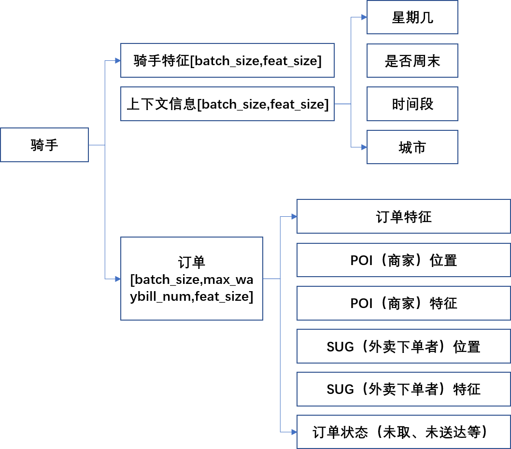
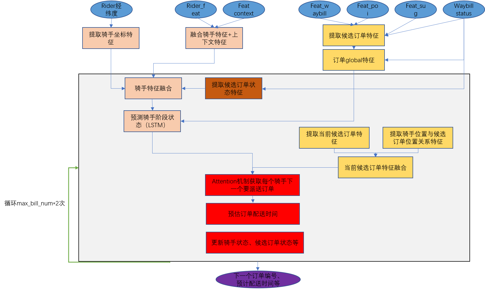

# 模型结构解析
## 1.什么是ETR？与ETA的区别？
&emsp;ETR（Estimated Time of Route）是指的是骑手的一条配送路径上的各个关键节口的预估时刻，关键节点包括取餐（入店、取餐、离店）和交付（入Sug、交付、离Sug）。在调度算法中，为骑手规划最佳的配送路径，并且预估路径上关键节点的时刻信息，用以指导派单和压单等功能算法。

&emsp;ETA用于预估送达时间，表征一个业务层次的指标；ETR应该是实现该业务指标的一个环节。

## 2.模型输入
&emsp;现实世界中的信息怎么融合进入DL网络？hashtable+embedding_lookup

图1 ETR模型结构

## 3.模型处理逻辑

图2 ETR模块处理逻辑

## 4.各模块网络特征
<table>
        <tr>
            <td>模块名</td>
            <td>模型结构</td>
            <td>shape</td>
        </tr>
        <tr>
        <td>融合骑手原始特征和上下文特征</td>
            <td>Embedding+elem_wise+mlp</td>
            <td>staic shape；输入：[batch_size, item_feat_size]；输出：[batch_size, 16]</td>
        </tr>
        <tr>
           <td>提取骑手坐标特征</td>
            <td>经纬度坐标周围四个点，Embedding+elem_wis+mlp</td>
            <td>staic shape；输入：[batch_size, 2]；输出：[batch_size, 16]</td>
        </tr>
        <tr>
           <td>提取候选订单特征</td>
            <td>Embedding + elem_wise + mlp</td>
            <td>staic shape；输入：[batch_size, max_waybill_num, item_feat_size]；输出：[batch_size*max_waybill_num, 16]</td>
        </tr>
        <tr>
           <td>订单global特征</td>
            <td>embedding + reduction + mlp</td>
            <td>staic shape；输入：[batch_size, max_waybill_num, 16]；输出：[batch_size, 16]</td>
        </tr>
        <tr>
           <td>提取候选订单状态特征</td>
            <td>embedding + elem_wise + mlp</td>
            <td>staic shape；输入：[batch_size, max_waybill_num]；输出：[batch_size, 16]</td>
        </tr>
        <tr>
           <td>骑手特征融合</td>
            <td>concat + mlp</td>
            <td>staic shape；输入：[batch_size, 16]*4；输出：[batch_size, 16]</td>
        </tr>
        <tr>
           <td>提取当前订单特征</td>
            <td>同“提取候选订单特征”</td>
            <td>--</td>
        </tr>
        <tr>
           <td>提取骑手当前位置和候选订单位置关系特征</td>
            <td>elem_wise + mlp</td>
            <td>staic shape；输入：（候选订单）[batch_size, max_waybill_num, 2],（骑手）[batch_size, 2]；输出：[batch_size*max_waybill_num, 16]</td>
        </tr>
        <tr>
           <td>当前候选订单特征融合</td>
            <td>concat + mlp</td>
            <td>staic shape；输入：[batch_size*max_waybill_num, 16]*2；输出：[batch_size*max_waybill_num, 16]</td>
        </tr>
         <tr>
           <td>Attention机制获取骑手下一个要派送的订单</td>
            <td>concat + mlp</td>
            <td>staic shape；输入：（骑手）[batch_size,,16],（订单）[batch_size*max_waybill_num, 16]；输出：（候选订单预测概率）[batch_size,max_waybill_num]（候选订单编号）[batch_size,1]</td>
        </tr>
        <tr>
           <td>预测订单配送时间</td>
            <td>gather+embedding+dense+concat+matmal</td>
            <td>staic shape；输入：（候选订单相关信息）[batch_size*max_waybill_num,16],（预测下一单结果）[batch_size, 1]；输出：（下一单预计配送时间）[batch_size,1]</td>
        </tr>
        <tr>
           <td>更新骑手状态、候选订单状态等</td>
            <td>gather+elem_wise</td>
            <td>staic shape；输入：（候选订单相关信息）[batch_size*max_waybill_num,16],（骑手相关信息）[batch_size, 16]；输出：（候选订单相关信息）[batch_size*max_waybill_num,16]，（骑手相关信息）[batch_size, 16]</td>
        </tr>
    </table>

分析：
    * 该模型是static shape，因此可优先尝试xla、trt优化
    * 该模型除batch维度外，其他维度size都很小（最大不超过16），因此增加计算密度需要大batchsize
    * 模型中有大量elem_wise算子，应该优先选择做elemwise_fuse优化方法，比如xla、tvm。

原论文：https://dl.acm.org/doi/abs/10.1145/3447548.3467068