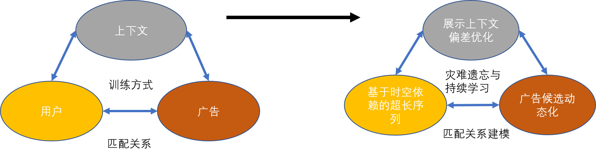
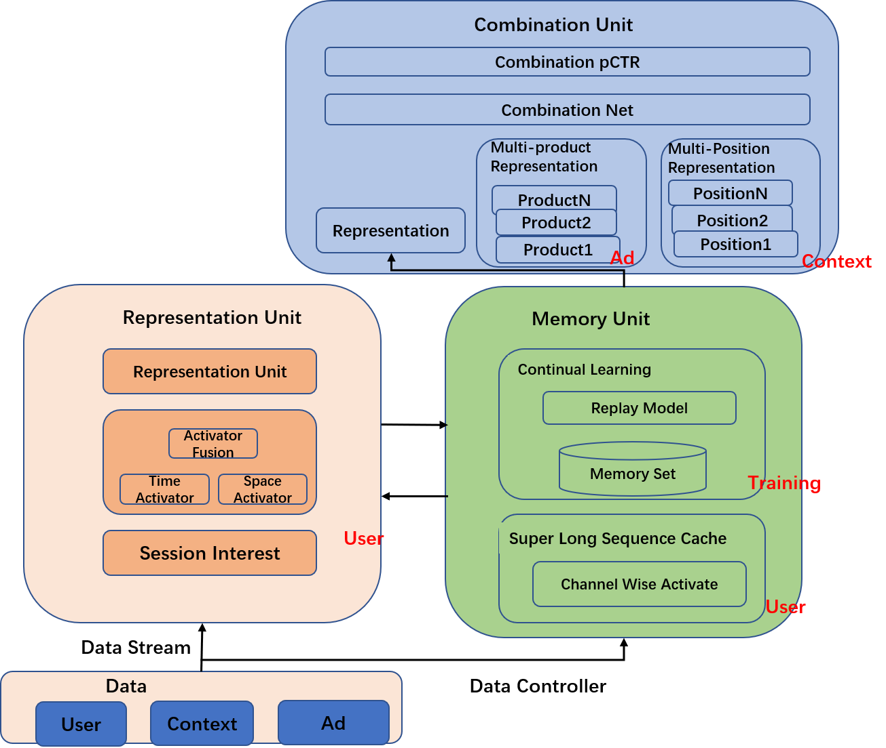
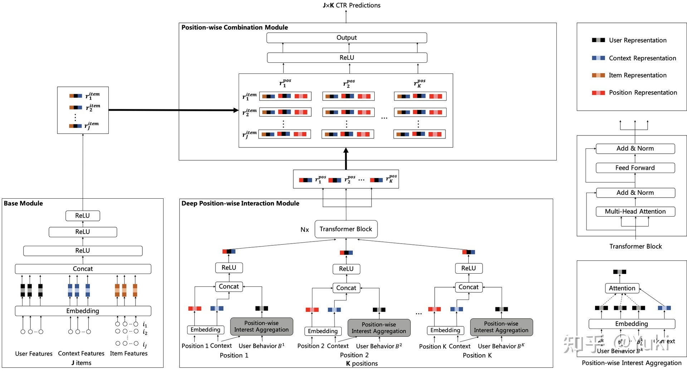
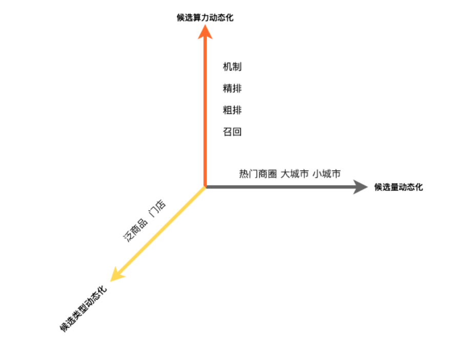
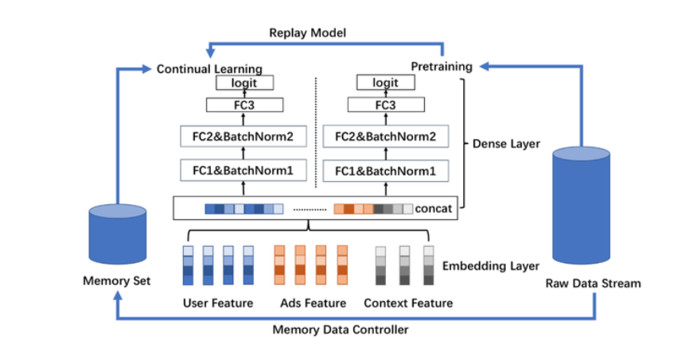
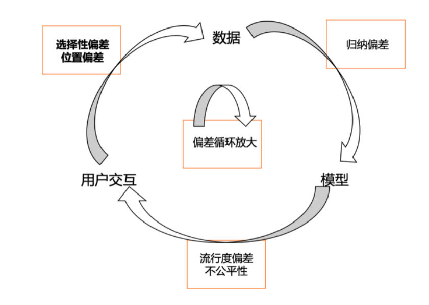

# 广告深度预估技术在到店场景下的突破
## 一、背景
### 1.1 背景
* 点击率/转化率/交易额预估问题，是广告、推荐领域的核心，预估值准确性与广告/推荐平台的营收和发展直接相关。
### 1.2 业务特征与挑战
* O2O业务的模型整体建模设计有一下空间和时间维度两方面的挑战：
    * LBS空间距离约束：线上门店/商品需要在有限的距离约束下表示，不同空间位置的差异性大，带来候选量差异大，上下文刻画重要等挑战。
    * 长周期性：门店消费习惯具有周期性强，长期行为影响大等特点，常规模型训练方式较难学习周期性，训练方式存在遗忘历史信息挑战。
### 1.3 预估技术简介
* 针对LBS距离约束和长周期性两方面的挑战，下文将介绍CTR预估技术方案。CTR预估是有监督机器学习问题$\min_{f} l(f(u,a,c), y)$，最优预测函数$\hat{f}(u,a,c)$被用户(u)、广告(a)、上下文(c)三个维度的函数输入，以及训练过程的函数求解$\min_{f}$所决定，其中上下文包括了请求query、请求列表上下文、请求地理位置等实时信息。结合LBS距离约束和上周期性两个核心挑战，对于CTR预估建模函数进行优化：

CTR预估建模关系图（图1）

    函数输入：上下文、用户、广告三个方面建模
        （1）基于位次组合的上下文偏差感知预估（上下文）：由于LBS距离约束挑战，空间位置差异引起不同展示上下文影响大，因此利用深度位置交叉网络将广告和位次组合建模，并基于位次信息强化不同请求的上下文偏差感知。
        （2）基于时空依赖的超长序列建模（用户）：针对长周期性和LBS距离约束两方面挑战，一方面基于预训练机制实现了超长序列建模，捕获用户周期性行为；另一方面，实现行为序列的时空联合建模，优化LBS距离约束问题。
        （3）广告候选动态化（广告）：由于LBS距离约束挑战，空间差异性引起不同位置候选差异大，广告和用户存在匹配关系，只有保障广告供给的充足性，才能对用户广告进行良好的建模，因此进行广告候选量/候选类型/算力资源的动态化，提高用户需求匹配的供给。
    函数求解：模型训练方式
        （1）灾难遗忘和持续学习（训练方式）：针对长周期性挑战，高维稀疏模型在学习最近数据的同时会遗忘历史数据，形成灾难遗忘。通过具备数据回放能力的记忆结构进行持续学习，实现对历史数据有效刻画。
        （2）模型整体结构如图2，结合User/Ad/Context/Training几方面优化，实现方式通过表示单元、记忆单元、组合单元三个模块构成高精度高量级的预估系统。其中表示单元通过加载流式数据，结合超长序列和实时序列，构建时空依赖激活；记忆单元集合历史和当前数据，在数据流控制的基础上，一方面提供历史超长序列的表达学习，实现序列长度为2000-10000用户全生命周期兴趣建模。另一方面面对灾难遗忘问题，通过具备数据回放能力的记忆结构进行持续学习，实现高精度的单点预估。组合单元提供组合能力，在广告方面，可以将记忆单元的综合表示与多个泛商品进行组合，在上下文方面，可以与多个位次表示进行组合，将单门店预估能力扩展到多位次多商品，进而感知展示上下文偏差，从而实现高精度高量级的组合预估系统（精排在线预估量级3000+）

CTR预估整体网络图（图2）

## 二、预估技术突破
### 2.1 上下文：基于位次组合的上下文偏差感知预估
* LBS约束下的位次偏差在不同上下文中有明显差异，一线城市广告充足且质量高，靠前位次广告更容易吸引用户点击，更易形成点击靠前位次的行为习惯，三线城市商户质量参差不齐，导致广告受其上下文自然的影响呈现差异。搜索广告场景的用户意图较强，更关注于靠前广告位，位次偏差较大，而在筛选列表广告场景，意图不明确的用户偏向于浏览优质商家，因此上下文偏差较大。
* **位次组合预估技术框架**：基于位次偏差问题，首先沉淀了深度位次交叉网络（DIPN）去同时预估多个位次的CTR，DPIN模型由三个模块组成，分别处理J个候选广告的基础模块（Base Module），处理K个（10个）候选广告位次的深度位次交叉模块以及组合J * k个交叉候选的位次组合模块（Position-wise Combination Module），不同模型需要预估的样本数量不同，复杂模块预估样本数量少，简单模块预估样本多，由此提高模型性能和保障服务性能，DPIN预估每个位次上的CTR并学习位次信息和其他信息的深度非线性交叉表示。
* **上下文偏差感知学习**：由于自然广告分别排序及广告插入自然列表的业务特点，在广告预估时可以考虑已排序好的自然列表，而多位次预估的技术框架赋予广告感知其局部自然上下文的能力，深度位次交叉模块在考虑位次、上下文、用户位次历史行为的基础上通过上下文自然聚合模块感知聚合局部自然上下文信息，从而更好地缓解上下文偏差。详见SIGIR 2021论文，Deep Position-Wise Interaction Network for CTR Prediction。（https://tech.meituan.com/2021/06/10/deep-position-wise-interaction-network-for-ctr-prediction.html）

基于时空依赖的超长序列模型图（图3）

### 2.2 用户：基于时空依赖的超长序列建模
* 针对长周期性和LBS约束两个挑战，进行用户建模深度优化。一方面针对长周期问题，基于“长短分离”用户行为序列设计原则，通过预训练方式建模长期兴趣；另一方面针对LBS约束问题，通过时空建模进行时间与空间的多重依赖关系学习，有效刻画在不同时空条件的用户表达。
* 在美团O2O场景下，用户行为习惯存在明显月级周期性（如图5所示）， 并且行为间周期性差异较大，例如脱毛/水光针类的周期性大于火锅/烧烤类，用户超长序列建模是捕获周期性行为特点的必要条件。在时空依赖方面，用户点击体现出明显的“长分散、短聚合”特点（如图6所示），即较短时间内用户的地理位置聚集在单点，但拉长来看，用户将漫游到多个地理位置；超长周期内，大部分用户还会有跨省跨城流动。因此时空联合联合建模存在潜能。综上两方面问题，整体建模如下：
$$P(Click = 1) = f(a,u,c,h(s))$$
$$s.t.$$ 
$$s = {(a_{i},t_{i},g_{i})}_{i \in N}$$
其中包括：（1）超长序列预训练：h(s)部分，将其建模为一个仅依赖于历史序列作为输入、用户兴趣向量作为输出的子网络，支撑千级别的超长序列推理性能；(2) 时空联合建模：$s = {(a_{i},t_{i},g_{i})}_{i \in N}$部分的建模, 下文具体介绍。
* **超长序列预训练**：针对以上超长序列的性能问题，基于“长短分离”设计，将超长序列单独预训练，同短期表达分离，超长序列模块负责将用户全生命周期序列进行激活和降维，提取用户长期兴趣的表达。主模型负责将用户长期表达与短期表达结合。线上推理时，超长序列可以直接读取天级别缓存的表达向量，通过短期表达部分补充因无法实时更新的效果损失，然后再进行长短期兴趣表达结合，最终线上性能增加由原先30+ms降至1ms以内，实现千级别序列复杂推理。为能捕捉用户周期性行为兴趣，采用Channel-wise Activator Layer结构设计，利用长期行为兴趣漫游的特点将超长序列切分为能表达不同兴趣的时间子序列（Sub Seq），并增加行为动态时间间隔表征后，同差异性属性进行多通道表达激活，实现基于类目周期性差异的兴趣表达。对比业界基于相关检索的超长序列方案，上述超长序列预训练并没有丢弃不相似的表达，充分建模全部行为。例如烧烤与素食、健身房和快餐之间意图负相关，但互相却又强影响，预训练建模以上负相关等更通用的行为影响，在美团数据集中也取得比检索方法更显著的效果。
* **时空联合建模**：依赖美团O2O的业务特点与挑战，我们充分考量其时间与空间属性，对用户的历史时空信息和当前时空信息进行了充分的建模和交互。我们分辨出用户行为的三重时空信息，即：用户点击发生时的时间、用户请求发出的地理位置、用户所点击的商户的地理位置。基于上述三重时空信息，我们提出Spatio-temporal Activator Layer：三边时空注意力机制神经网络来对用户历史行为进行建模，通过对请求经纬度信息、商户经纬度信息和请求时间的交互，囊括了同构空间信息深度交叉（用户历史请求位置和用户当前请求位置、用户历史点击商户位置和用户当前目标商户位置等）、异构空间信息深度交叉（用户历史请求位置和用户当前目标POI位置、用户历史点击商户位置和用户当前请求位置）、时间信息深度交叉的三边时空信息交互机制。针对空间信息交叉，我们进一步采用地理位置哈希编码和球面距离相结合的方式，以综合表达绝对空间信息和相对位置信息；针对时间信息交叉，我们也采用绝对与相对时间相结合的方式，有效实现用户行为序列在不同时空条件下的三边表达。从业务角度，针对不同的业务特性，我们进行空间信息表达的动态归一。比如在美食业务中，我们刻画用户搜索地和商户的相对距离信息；而在空间变迁属性更强的酒店业务中，当用户搜索词包含地址词时，我们刻画该地址和目标商户的相对距离信息。最后，经上述网络编码后的时空信息经过注意力机制网络融合，得到LBS场景下用户超长行为序列对不同请求候选的个性化表达。详情，请参考团队的CIKM 2021论文《Trilateral Spatiotemporal Attention Network for User Behavior Modeling in Location-based Search》

### 2.3 广告：广告候选动态化
* 广告同用户存在着匹配关系，在用户意图精准理解的基础上，充分的广告供给能够进一步释放潜能。而在LBS距离约束挑战下，不同请求的广告候选存在很大差异。因此如图8所示，我们从候选量、候选类型、候选算力三个维度构造广告候选动态化系统，实现精细化的供给匹配，具体优化如下：

广告候选动态化三维图（图4）

* **候选量动态化**：在广告/推荐领域，由于性能和资源限制，召回->粗排->精排->机制，各层之间普遍存在漏斗候选截断，其中的精排候选数一般设置固定值。美团业务的距离约束特点显著，大型城市是小型城市平均候选数的59倍。根据城市、商圈等空间粒度进行候选量动态化后，可以在资源固定下最大限度释放热门地区的排序效果，特别是大型城市效果明显，RPM提升约20%。由于候选量大幅度提升，精排模型有更严重的选择性偏差问题——线上面对的扩量候选与此前系统的候选不一致，为扩量前系统候选的超集。将候选扩量对应的流量理解为Explore流量，对CTR模型训练进行了多阶段优化，进一步取得效果[13]，整体优化在部分筛选列表广告RPS提升5%~10%。
* **候选类型动态化**：在候选量动态化的基础上，我们进一步进行了候选类型动态化。因不同类型均为广告，我们在此处不采用Ad概念，在某些类目上，受LBS限制门店数较少，而每个门店下的泛商品（门店下更细粒度候选，同门店差异见上图，例如在结婚品类下的某婚纱照为商品）较多，将候选类型从门店扩展到门店+泛商品后，候选供给在部分类目可以扩大约30倍。并且在业务中，用户意图逐渐呈现具体化、明确化与多样化特点，例如“写真”等搜索关键词增多，粗粒度的门店候选已经不足以匹配细粒度用户意图。通过深度个性化的异构候选混排，能够匹配细粒度的用户意图，给用户展示最符合其兴趣偏好的候选类型。如图9所示，我们通过组合预估实现异构混排系统，主网络的高复杂性门店表征通过共有表达的迁移学习，和商品网络的高数量级商品表征进行维度动态转换对齐，实现数千量级的门店/泛商品异构混排系统。在部分筛选列表广告RPM提升10%~15%。
* **候选算力动态化**：通过动态的候选供给我们发现更多的候选能够带来效果空间，在此基础上我们进一步进行算力动态化，从性能角度进一步提升候选量级。广告系统收到请求后，会经过召回、粗排、精排、机制模块，最终生成广告展现顺序。其中各模块的超时时间和资源是固定的，导致总体算力缺乏弹性，容易因候选过多出现总体请求超时而不出广告的情况，或是候选过少出现多余算力浪费的现象。因此我们进行候选算力动态化，根据流量价值调整每个模块的耗时，通过全局优化实现在有限算力下收益最大化：首先在工程架构上增加各个服务算力弹性变量，如超时时间、模型复杂度和计算并行度等等，实现了效果和算力的灵活兑换。之后在算法上通过流量价值预估模块预估当前请求价值，确定各阶段打分数。在接下来的各服务阶段，结合当前算力消耗与预估价值情况，即时调整后续阶段算力弹性变量，进一步释放了效果空间。在筛选列表广告RPM提升约2%。

### 2.3 训练方式：灾难遗忘与持续学习
* 灾难遗忘(Catastrophic Forgetting)是模型学习同人脑学习的一个重要差异，指的是同一个网络模型，在学习新的任务的时候，因分布变化而导致老任务学习的模型权重损坏。在美团广告业务，无论是用户和商户均存在周期性特点，并且高维稀疏网络特性会放大这个特点，现象是在拟合新数据模式过程中，遗忘具备周期性的老数据，形成了灾难遗忘。下面会介绍长周期性挑战，与高维稀疏网络结构问题，以及对应的持续学习解决方案。
    * **周期性数据模式**：不同于传统机器学习数据独立同分布假设(i.i.d.)，CTR预估模型面临着动态非平稳的外部环境。特别地，在我们的O2O业务中，新用户、新商户不停出现，流行元素如小龙虾、烤肉等不时演变，夹杂着周中简餐周末大餐等节日性、季节性、星期级，小时级特征，对CTR预估模型的持续学习提出了挑战，要求我们的模型能够快速拟合新出现的数据模式。针对这类时变数据的学习任务，一种常见选择是流式训练。流式训练将数据按照时间顺序依次喂入模型，以Regret为目标让模型实时动态地调整模型参数，达到拟合最新数据分布的目的。但是，单纯地流式训练有过分强调新数据模式而遗忘过往学习到的老数据模式的危险。特别地，在我们的O2O业务场景下，存在大量周期性数据模式，下面将以星期级周期为例进行介绍。
    * **高维稀疏网络的结构匹配性**：不同于NLP/CV领域，广告/推荐领域的DNN模型具有显著的参数不平衡性，即高维度稀疏的Embedding层约有亿级~千亿级别参数量的参数量，而连接Embedding到Output的FC层(Fully Connected Layers)却低维稠密，网络中极度稀疏的Embedding层占据99.99%+的参数量，该不平衡性易于引发老数据模式的遗忘问题。以天级更新模式的星期几特征为例，线上推理的数据是周六(t, w(t) = 6) 数据，训练时在未充分纳t时刻数据时，会更多的拟合在周五(t-1)特征上，而实际上在上一周的周六(t-7)与线上推理数据(t)具有更强的分布一致性。特别地，如果我们使用星期几这一离散特征，在高维稀疏的Embedding层在线上推理的t时刻会直接查询到t-7天的Embedding，而低维稠密的FC层会查询到t-1的FC层，会引起严重的结构不匹配问题，形成星期属性模式的灾难性遗忘。更具一般性地，训练中存在着周中简餐，周末大餐等复杂模式的灾难遗忘，引起效果大幅退化。
    * **面向未来分布的持续学习**：为系统性地解决上述问题，我们采用持续学习中的数据回放技术，在流式训练的基础上进一步拟合回放的数据，加强模型在无遗忘约束下的持续学习能力。具体地，为结合流式训练和持续学习的数据回放技术，我们采用FC层分多塔的结构来达成预训练模型可流式更新、持续学习模型可依赖最新预训练模型更好地拟合当前数据的效果。如下图所示，通过流式训练我们维护一个预训练模型；而为避免模型过分拟合最新数据而导致历史稀疏Embedding层参数和上层FC层参数不匹配的问题，通过数据控制器(Data Controller)维护一份记忆集(Memory Set)，其中的数据为根据未来分布预测，在历史数据中采样得到，并将该份记忆集提供给基础模型用于持续学习，从而在加强对未来分布数据的模型预估能力。

灾难遗忘和持续学习训练模式（图5）

# 三、预估技术新趋势
* 上文介绍了基于O2O特点的CTR技术突破，我们将优化方法推广在转化率、交易额预估问题，其中LBS距离约束在转化率中起到更重要的影响，因方法接近，不再进行赘述。同一技术的点击率预估优化效果在不同业务类型中也存在一定差异，意图强的搜索广告场景，上下文差异性更大，Context相关优化有更明显效果。而在意图弱的信息流广告场景，User建模有更大的空间。那么预估技术如何持续突破的系统上线？迭代路径从前期通过模型复杂度提升，到现阶段结合问题的模型灵活设计均取得效果，而未来我们认为将越来越剥离模块与目标设置的现状，消除建模中人为的设置假设。
    * **模型内推理量级动态化**：广告系统通常分为召回、粗排、精排（预估）等多个模块，模块漏斗遵循的一个核心设计逻辑是简单模块打分量级大（例如粗排），复杂模块打分量级低（例如精排）。以递归视角进一步理解子模块设计，将设计逻辑泛化到模型内，同样存在简单的网络部分打分量大，复杂的网络部分打分量低，同一个网络打分量差异化的优化方式。例如粗排常用的双塔网络结构(Two-tower Network)在User端打分一次，Ad端打分多次。更具一般性的形式并不局限在表达能力受限的双塔结构，而在于更充分的应用打分量与复杂度的关系进行灵活设计，例如本文阐述的DPIN(Deep Position-wise Interaction Network)组合网络部分打分量大，基础网络部分打分量小，同在本文阐述的异构混排网络，超长序列预训练优化同样适用于这一趋势。未来将在更细化的层面进行推理量级动态化，通过每一个局部精度与性能的平衡达到整体的最优平衡。
    * **问题间评估指标差异化**：评测指标是一个比优化方式甚至更重要的问题，点击率预估最经典的评测指标为AUC，而随着模型精度的提升，离线AUC提升同线上不一致的情况逐渐增多。回归到预估问题本身，实际排序系统是在固定请求固定位次下的最优排序，等价寻优User × Context × Time限定条件的Ad最优序。time条件在持续变化难建模，为简化问题，以User/Context维度分组，近似寻优Ad最优序。基于以上假设，User/Context分组的“组间序”同“组内序”并不具备等价的业务意义。例如个性化优化问题，每一个User作为一组进行分组为例，User Group AUC[12]同线上具有更强的一致性；而在Context中的Position Bias问题中，我们发现通过Position Group AUC(PAUC)评估同线上系统具有更强的一致性。在全局AUC增长挑战性变大的背景下，不同问题进行差异性评估指标设计，进而指导模型优化，是取得效果的一个关键趋势。
    * **链路模块间目标多元化**：系统整体目标面对排序问题，先是解耦为召回、粗排、精排等多模块独立优化，而后针对整体性排序问题，链路目标一致性优化成为一个明显的演进趋势。在召回->粗排->精排目标一致，取得明显效果的同时，存在着因多模块过于同质化、协同共振引起的马太效应。以召回为例，是否应该由其他路模块，例如探索路召回来解决这个问题？更具泛化性地，多路召回之间的强互补性，能够提供给下游更优的候选超集，召回各个路之间面向Diversity Loss进行优化是未来的探索性方向之一。随着模块间关系动态变化，广告系统目标设计存在着一致性与差异性的辩证关系。
    * **搜索推荐边界模糊化**：从广告视角，团队内的搜索广告、推荐广告间做法呈现逐步边界模糊化特点。传统搜索广告围绕意图明确进行Query理解，进而内容适配。逐渐Query相关的刻画不能完全满足用户意图的细化，搜索问题逐渐转变为在Query约束下的个性化匹配问题。边界模糊化带来的一个技术现象就是全域数据的运用，搜索、推荐间的全方位深度迁移学习是取得效果的一个关键。
    * **模型学习非监督化**：整个广告系统中，是在用户交互、数据、模型之间不断产生反馈循环，在这个过程中会有偏差循环放大的问题，例如产生偏差的数据会喂入模型影响展示，数据回溯到模型形成进一步归纳偏差。传统的建模方式是将整个动态的系统简化为监督问题进行预估建模，优化集合仅为线上集合的子集，效果限制随迭代愈发明显。未来针对监督模型无法充分建模的候选超集依然有较大空间。在实际动态演化的广告系统中，无论是新目标定义、模型优化还是AB Test评测方式都有较大的探索潜能。Debiasing问题优化详情参照团队的KDD Cup 2020冠军技术分享《KDD Cup 2020 Debiasing比赛冠军技术方案及在美团的实践》

广告系统的反馈环路，偏差积累循环（图6）

* 参考链接：
    * https://baijiahao.baidu.com/s?id=1713737100788779347&wfr=spider&for=pc
    * https://zhuanlan.zhihu.com/p/380247607
    
